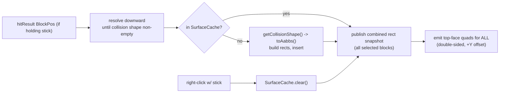

# Plan: In-world collision surface rendering

> Current short-term plan (for execution by another agent). Durable project
> knowledge lives in [AGENTS.md](AGENTS.md); subsystem detail in
> [docs/rendering.md](docs/rendering.md).

Move the in-world overlay from a fixed placeholder (annulus) to the **horizontal
collision surface** of blocks: the upward-facing faces of a block's collision
shape that an entity can stand on. The rendering strategy is to emit the top
face of every collision sub-box and rely on depth-testing to occlude the faces
buried inside real geometry (a deliberately simple approach - no per-column
height resolution; see "Rendering strategy" below).

## Interaction (stick = brush)

The stick becomes a **brush** for selecting blocks whose standable surface is
drawn:

- While **holding a stick**, the block under the crosshair (resolved downward,
  see Approach) is added to a persistent **selection set** each frame, so
  sweeping the crosshair paints a trail of blocks.
- **Every selected block's surface is drawn every frame** (not just the hovered
  one).
- **Right-clicking** with the stick **clears the selection** (reset).
- No color cycling - surfaces use a single fixed color.

Assumption (easy to flip): surfaces are drawn while the stick is held; the
selection persists in memory when you switch items and reappears when you
re-equip the stick, and is only emptied by right-click or world unload. If you'd
rather they stay visible regardless of the held item, that's a one-line change to
the visibility gate.

## Approach

Data source is the block's **collision** `VoxelShape` (not the visual/outline
shape):

- `BlockState.getCollisionShape(level, pos, CollisionContext.empty())` - the
  collision shape.
- `VoxelShape.isEmpty()` - detects pass-through blocks (tall grass, flowers,
  cobwebs). If empty, walk downward (`pos.below()`) until a non-empty shape is
  found (capped, stop at world min-Y), so looking at tall grass resolves to the
  dirt/grass block under it.
- `VoxelShape.toAabbs()` -> `List<AABB>` of axis-aligned sub-boxes. Each
  sub-box's top (`maxY`) over its `[minX,maxX] x [minZ,maxZ]` footprint is a
  standable rectangle. This handles partial blocks automatically: a slab -> one
  box (top y+0.5), a stair -> full lower box (top y+0.5) + half upper box (top
  y+1.0), a fence -> tall post (top y+1.5) + bars.

### Rendering strategy

Why emitting every sub-box's top face is visually correct without extra math:
the existing `FILLED` pipeline depth-tests against the world (the
`WorldOverlayManager` comments note that removing depth-stencil is what would
make it "through-walls"). So drawing the top of every sub-box and letting
depth-testing hide the parts buried inside real geometry yields the correct
visible standable surface (e.g. stairs render as an L: front at y+0.5, back at
y+1.0). The alternative - computing a precise per-(x,z)-column max-height
surface so only the true uppermost face is ever emitted - is more code and only
matters for rare blocks with internal stacked boxes, so it is intentionally out
of scope here.

### Data model (doubles)

Collision shapes are unions of axis-aligned cuboids, so every standable patch is
an axis-aligned rectangle. Snapshot each top-face rectangle directly in
**world-space doubles** - no discretization. (We deliberately skip an integer
1/16-pixel model: the surfaces will later be expanded by entity dimensions like
`1.95` that are not `1/16`-aligned, so quantizing buys nothing; rounding-error
handling is deferred to that future math layer.)

- `record StandableRect(double minX, double minZ, double maxX, double maxZ, double topY)`
  in absolute world coordinates (resolved `BlockPos` already folded in).
- Built straight from each `AABB`: `minX = pos.getX() + box.minX`, ...,
  `topY = pos.getY() + box.maxY`.

### Selection set / cache

The selection set and the compute-cache are the **same structure** - a
`SurfaceCache` mapping `BlockPos` -> `{BlockState, List<StandableRect>}`:

- **Brushing = inserting:** while holding the stick, `extract` resolves the
  hovered block and adds it (compute-once) to the map. Already-present blocks are
  not recomputed, so a sweeping crosshair just accumulates entries cheaply.
- **It is the draw set:** every entry's rectangles are rendered each frame, so
  the map directly represents what is on screen.
- **In-memory only; not persisted across save/load.** Cleared by right-click
  (reset) and on world unload / dimension change / disconnect (hook
  `ClientLifecycleEvents` / a level-identity check, mirroring the manager's
  existing `CLIENT_STOPPING` cleanup).
- **Staleness:** each entry stores its source `BlockState`; on `extract`, prune
  or recompute entries whose `level.getBlockState(pos)` no longer matches (and
  drop entries that became collision-empty), so the painting stays accurate
  after place/break. (For large selections this is a per-entry block-state
  lookup; fine for now, can be throttled later.)
- **Scope/ownership:** the map is mutated only during the extraction phase
  (single-threaded within the overlay dispatch). For the render thread, `extract`
  publishes an immutable combined `List<StandableRect>` (all entries' rects
  concatenated) into a `volatile` snapshot that `emit` reads - same handoff
  pattern as today.
- A size cap / eviction policy can be added later; clear-on-reset and
  clear-on-world-change bound it for now.

## Files

- Replace
  [src/client/java/com/example/overlay/client/widgets/BlockTopAnnulusOverlay.java](src/client/java/com/example/overlay/client/widgets/BlockTopAnnulusOverlay.java)
  with a new `CollisionSurfaceOverlay.java` (same `WorldOverlay` contract):
  - `extract`: while holding a stick, resolve the hovered block and add it to the
    `SurfaceCache`; prune stale entries; publish the combined rect list to a
    `volatile` snapshot.
  - `emit`: draw every rect in the snapshot's top face with both windings and
    `Y_OFFSET`, in a single fixed color (drop the palette).
  - `isVisible`: holding a stick and snapshot non-empty (per the visibility
    assumption above).
  - `onUseItem`: **clear the `SurfaceCache`** (was color-cycle); keep the
    `player.swing(hand)` feedback. Only acts while holding a stick.
- Add a new `SurfaceCache.java` (in `com.example.overlay.client` or a
  `client/collision` subpackage): a `BlockPos -> {BlockState, List<StandableRect>}`
  in-memory map with insert/get-or-compute, a staleness prune against the current
  `BlockState`, a `clear()`, and a way to read all rects. It is both the cache
  and the brush selection set.
- Update registration in
  [src/client/java/com/example/overlay/client/WorldOverlayManager.java](src/client/java/com/example/overlay/client/WorldOverlayManager.java)
  `bootstrap()` to register the new widget. No change to the GPU/pipeline
  plumbing. Add a world-unload / disconnect hook (or level-identity check) that
  calls `SurfaceCache.clear()`.
- [src/client/java/com/example/overlay/client/WorldOverlay.java](src/client/java/com/example/overlay/client/WorldOverlay.java)
  interface unchanged.
- Docs: refresh [docs/rendering.md](docs/rendering.md) (new widget,
  collision-shape approach, rectangles + double-precision rationale), bump
  Current status / Future work in [AGENTS.md](AGENTS.md), and refresh this
  `PLAN.md` (per the doc-upkeep-per-PR convention).

## Risks / notes

- `26.1.2` name verification: confirm `VoxelShape`, `CollisionContext`,
  `toAabbs`, `getCollisionShape`, the world min-Y accessor, and
  `BlockGetter`/`Level` against the resolved jars (names may differ as with
  `Identifier`). Compiler is the oracle.
- Extraction-thread reads: the current widget already reads `hitResult` in
  `extract`; block-state reads there are read-only and consistent with that, but
  keep them minimal and snapshot immutable.
- Downward resolution must cap and stop at world min-Y to avoid scanning into the
  void (e.g. tall grass over a hole).
- Working in doubles (not a discretized grid) is intentional: the planned next
  step expands these surfaces by entity dimensions (e.g. ravager `1.95`), which
  are arbitrary `float`s positioned at continuous double coords - not
  `1/16`-aligned - so quantizing blocks would be wasted work. Rounding/precision
  handling is deferred to that future math layer.
- Buffer size: brushing many blocks grows the combined vertex list; if a
  selection can exceed `SMALL_BUFFER_SIZE`, size the `BufferBuilder`/ring buffer
  to the snapshot (the manager already resizes the GPU buffer, but confirm the
  CPU-side allocator headroom). A reasonable per-frame vertex budget / selection
  cap is acceptable.

## Acceptance (manual via runClient; build gate via `./gradlew build`)

Per-block shape correctness (brush one block, inspect):

- Full block: 1x1 surface at top (y+1.0). Bottom slab: surface at y+0.5; top
  slab: at y+1.0.
- Stairs: L-shaped two-level surface matching orientation (y+0.5 front, y+1.0
  back).
- Fence: small post-top high (~y+1.5) plus bar tops.
- Tall grass / flower: surface appears on the solid block below.
- Carpet / pressure plate: thin surface near y+0.0625.

Brush behavior:

- Holding a stick and sweeping the crosshair paints a growing set of blocks;
  all their surfaces stay drawn each frame (not just the hovered one).
- Right-clicking with the stick clears all painted surfaces.
- Breaking/replacing a painted block updates or drops its surface (staleness).
- Selection clears on leaving the world; no color cycling remains.

## Todos

Implemented in two stages: first single-block surface detection + rendering
(recomputed every frame, no cache), then the cache and the brush/clear stick
behavior. **Both stages are complete and the build gate passes.**

### Stage 1 - core surface detection + rendering (hovered block, every frame)

- [x] **extract**: In `CollisionSurfaceOverlay.extract`, while holding a stick
  resolve the hovered block downward to the first non-empty collision shape
  (capped, stop at world min-Y), build world-space-double rectangles from
  `getCollisionShape(...).toAabbs()`, and publish them to a `volatile` snapshot.
  Recompute **every frame** for the single hovered block (no cache yet).
- [x] **emit**: In `CollisionSurfaceOverlay.emit`, draw every rectangle in the
  snapshot as a top-face quad (world-space doubles + `Y_OFFSET`) with both
  windings, in a single fixed color.
- [x] **wire**: Replace `BlockTopAnnulusOverlay` with `CollisionSurfaceOverlay`,
  register it in `WorldOverlayManager.bootstrap()`, gate `isVisible` on
  holding-a-stick + non-empty snapshot, and drop the color cycle (`onUseItem` is
  a no-op / arm-swing only for now).
- [x] **verify**: Via `runClient`, confirm the per-block shape correctness cases
  (full / slab / stairs / fence / tall grass / carpet) from Acceptance before
  proceeding.

### Stage 2 - cache + brush behavior (only after Stage 1 works)

- [x] **cache**: Add `SurfaceCache` (`BlockPos -> {BlockState, List<StandableRect>}`,
  in-memory, non-persistent) acting as both compute-cache and brush selection
  set: insert/get-or-compute, prune stale entries by `BlockState`, `clear()`, and
  read-all-rects.
- [x] **brush**: Change `extract` to **add** the hovered block to the
  `SurfaceCache` (accumulate the selection) instead of recomputing one block,
  prune stale entries, and publish the combined rects of all entries to the
  snapshot so every selected block is drawn each frame. Make `onUseItem` clear
  the cache. (World-unload/disconnect reset is done via a self-contained
  **level-identity check** in `extract` rather than a manager-side hook.)
- [x] **docs**: Update `docs/rendering.md` (new widget, collision-shape +
  brush/selection approach, rectangles + double-precision rationale), `AGENTS.md`
  Current status / Future work, and this `PLAN.md`.
