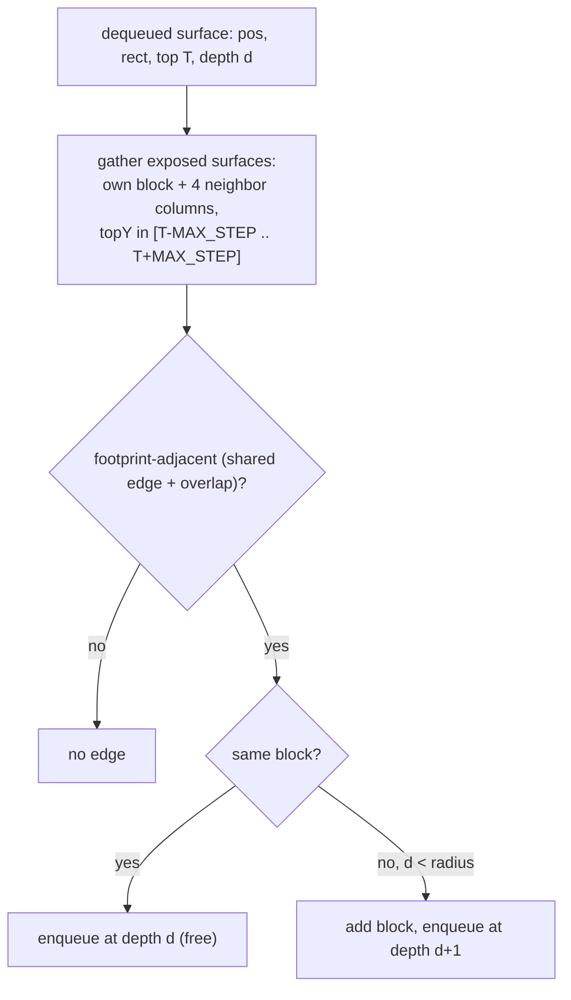

# Plan: v2 standable-surface reachability (walkable flood)

> Current short-term plan (for execution by another agent). Durable project
> knowledge lives in [AGENTS.md](AGENTS.md); subsystem detail in
> [docs/rendering.md](docs/rendering.md).

Make the right-click flood follow walkable terrain: a surface-indexed
mutual-reachability flood. Surfaces are occlusion-aware (a sub-box top is clipped
to where nothing solid sits directly above, intra- and inter-block), and edges
are footprint-aware (two surfaces connect only across an edge their rects
actually share) plus height-gated by a single `MAX_STEP` via a bounded vertical
window. Together these kill the stair-back "ghost step". Walkable-only; holes,
fall-tracing, outline rendering, and the step up/down split are deferred.

## v1.5 - debug rendering (land + verify before v2)

Two small debug aids on the current v1b flood; both carry into v2.

1. **Through-walls rendering.** Disable depth testing on the shared world-overlay
   pipeline so surfaces draw over solid geometry, making buggy surfaces buried
   inside blocks visible. In
   [`WorldOverlayManager`](src/client/java/com/example/overlay/client/WorldOverlayManager.java)
   the `FILLED` pipeline is built from `DEBUG_FILLED_SNIPPET`; add
   `.withDepthStencilState(Optional.empty())` (per the existing comment in that
   file) so it no longer depth-tests. Affects only `CollisionSurfaceOverlay` (the
   sole world overlay). Debug behavior for now.
2. **Distance coloring.** Color each surface by its BFS distance from the clicked
   block (debugging connectivity).
   - [`SurfaceCache`](src/client/java/com/example/overlay/client/SurfaceCache.java):
     add `int distance` to `Entry`; `add(level, pos, distance)`; `select` passes
     the current ring depth (seed `= 0`); `pruneStale` keeps the stored distance;
     `allRects()` returns `(StandableRect, distance)` pairs (small record).
   - [`CollisionSurfaceOverlay`](src/client/java/com/example/overlay/client/widgets/CollisionSurfaceOverlay.java):
     the `volatile` snapshot becomes the distance-tagged list; `emit` maps
     distance -> color via an HSV hue ramp (e.g. `hue = (distance * 0.15) mod 1`),
     keeping `ALPHA`. Drop the single fixed RGB.

Separate commit ("v1.5: debug rendering"), verified in-game before v2 starts.

### Verify in-game (v1.5)

- [ ] `./gradlew build` passes.
- [ ] Selection surfaces render **through terrain** (visible behind/inside solid
  blocks).
- [ ] The clicked block and each ring out to `radius` are **distinctly colored**,
  and the colors track BFS distance (center one color, its neighbors the next,
  etc.).

## Model (confirmed)

- **Surface-indexed, not block-indexed.** A flood node is a single standable
  **surface** = `StandableRect`. A block contributes one node per exposed top,
  so a stair is two nodes (`+0.5` tread, `+1.0` top), and stacked surfaces
  (spiral staircases, overhangs) are distinct nodes.
- **Occlusion-aware surfaces.** A sub-box top counts as standable only over the
  footprint where nothing solid sits **directly above** it - clipped by both the
  same block's higher sub-boxes and the block above. So a stair's full-footprint
  bottom slab top becomes only its exposed front half (not the buried back half);
  a block directly under another block exposes no top. This removes the buried
  "ghost" surfaces.
- **Footprint-aware edges.** Two surfaces connect only if their rects share an
  **edge with positive overlap** (they actually abut horizontally), AND the
  height gate passes. This stops a partial-footprint surface (e.g. a stair tread)
  from connecting on a side it doesn't physically touch.
- **Mutual height gate:** an edge requires `|T2 - T| <= MAX_STEP`. This keeps the
  flood **bounded** (it never descends into a pit it can't climb back out of),
  which is what makes holes naturally disjoint and avoids any infinite scan.
- Together, occlusion + footprint-aware edges kill the **stair-back ghost step**
  (you can no longer "walk up the back of a stair as a 0.5 step").
- **One `MAX_STEP`** (default `1.0`) for now; the step-up/step-down split only
  matters for the deferred directed hole pass, so it's not added yet.
- **Walkable-only.** Deferred to later milestones: hole detection, tracing a
  fall to its landing, rendering the region outline/edges, asymmetric up/down
  steps, and entity-height headroom (we only require the space *immediately*
  above a surface to be clear, not a full entity height).

## What changes

[`SurfaceCache`](src/client/java/com/example/overlay/client/SurfaceCache.java)
(surface extraction + the flood). The overlay is unchanged -
`cache.select(level, start, SELECTION_RADIUS)` keeps its signature;
`SELECTION_RADIUS` stays in
[`CollisionSurfaceOverlay`](src/client/java/com/example/overlay/client/widgets/CollisionSurfaceOverlay.java).

### 1. Occlusion-aware surface extraction (replaces `computeRects`)

`exposedSurfaces(Level, BlockPos pos)` -> `List<StandableRect>`:

- `boxes = collisionShape(pos).toAabbs()`; `aboveBoxes = collisionShape(pos.above()).toAabbs()`.
- For each box `B` (top `h = B.maxY`, footprint `F = [minX,maxX] x [minZ,maxZ]`):
  - **Occluders** = footprints of solids occupying the slab just above `h`:
    same-block boxes `B'` with `B'.minY <= h < B'.maxY`, plus above-block boxes
    `A'` with `A'.minY + 1 <= h < A'.maxY + 1` (only fires for `h == 1.0` under a
    block whose collision reaches its floor).
  - `exposed = subtractRects(F, occluders)` (rectangle subtraction -> 0..N rects).
  - Emit a `StandableRect` (world coords, `topY = pos.getY() + h`) per exposed rect.
- Add a `subtractRects(rect, occluders)` helper (guillotine subtraction; each cut
  yields up to 4 pieces). Use a small epsilon for coordinate compares.

This also de-ghosts **rendering** (only exposed tops are drawn); the depth test
still guards z-fighting / surfaces buried by non-adjacent world geometry.

### 2. Surface flood (rewrites `select`)

- **Node** = `StandableRect` + owning `BlockPos` (small local record).
  `visited` = `Set<StandableRect>` (rects are globally unique by world coords).
- **Candidates** from a node `(pos, rect@T)` = exposed surfaces of `pos`'s own
  block (siblings) and the 4 neighbor columns, gathered over a **bounded vertical
  window** with `topY` in `[T - MAX_STEP, T + MAX_STEP]` (`collectSurfaces`).
- **Edge test** for a candidate `(pos2, rect2@T2)`:
  - height: in-window (already) i.e. `|T2 - T| <= MAX_STEP`;
  - **footprint-adjacent**: `rect` and `rect2` share an edge with positive
    overlap - they touch along X (`rect.maxX == rect2.minX` or vice-versa) with
    Z-overlap `> 0`, or along Z with X-overlap `> 0` (epsilon-tolerant). Two
    sibling surfaces sharing an internal edge (stair tread/top) satisfy this too,
    so intra-block stepping falls out of the same rule.
- **Depth/radius**: a node carries depth; a candidate in a *different* block is
  `depth + 1` (only expanded while `< radius`); a *same-block* sibling stays at
  the same depth (free). So `radius` ~ block distance.
- On accept: `add(level, pos2)` (store owning block) + enqueue.
- Seed: `exposedSurfaces(resolvedStart)`, all enqueued at depth 0, block added.
- A per-`select` `Map<BlockPos, List<StandableRect>>` memo so each block's
  surfaces are computed once.
- Remove `isStandable` and the v1b same-Y loop.

Storage stays `BlockPos`-keyed: reaching any surface `add`s the whole block. With
occlusion + footprint edges a block's exposed surfaces are normally one connected
walkable patch, so this matches the reached set; the rare exception (a block with
two disjoint exposed surfaces, only one reached) over-renders the other - noted.

## Docs (same commit as v2)

- [docs/rendering.md](docs/rendering.md): rewrite the `SurfaceCache` section -
  occlusion-aware surface extraction (replaces emit-all-tops + depth), the
  surface flood (footprint-aware edges + mutual height gate + bounded window),
  and the walkable-only scope with holes/outline/asymmetric-steps deferred. Note
  the rendering strategy change (clipped tops, depth now only for world-geometry
  occlusion) and the v1.5 debug aids (through-walls + distance coloring).
- [PLAN.md](PLAN.md): mark v2 done / refresh.
- Defer the `AGENTS.md` Milestone-3 status rewrite until the feature line is
  settled (note it as pending), to avoid churning it each stage.

## Risks / notes

- **Rectangle subtraction correctness** is the main new risk: get the guillotine
  cuts and epsilon compares right, or surfaces get gaps/overlaps. Worth a couple
  of targeted shapes (stair, slab, block-under-block) when verifying.
- **Spiral staircases / overhangs:** handled because nodes are individual
  surfaces; two passes at one XZ are distinct rects. Verify they stay separate.
- **Whole-block storage:** rendering all exposed rects of a reached block matches
  the reached set except for the rare block with two *disjoint* exposed surfaces
  where only one is reached (over-renders the other). Acceptable; noted in code.
- **No entity-height headroom:** a surface with only the immediately-above cell
  clear counts as standable even under a low ceiling; full headroom is deferred.
- **Diagonal moves** still excluded (4-connected via the neighbor columns).
- **Double arithmetic:** epsilon-tolerant edge/overlap compares; clamp the
  vertical window scan at `level.getMinY()`.
- **Cost:** per surface, own block + 4 columns x a few blocks, each
  `toAabbs()` + subtraction; the per-`select` memo computes each block's surfaces
  once. Bounded by `radius`, and runs only on right-click (not per frame).
- **Compute from the real shape, not a block-type table.** Reading the actual
  `VoxelShape` is correct for corner stairs / walls / etc. by construction (a
  hand-authored table would have to enumerate those and would break on modded
  blocks). The intra-block clip is a pure function of the shape, so if profiling
  ever warrants it, memoize the per-shape result (vanilla's finite shape set
  makes that a natural cache); inter-block occlusion depends on the block above,
  so it can't be a per-block table anyway. Treated as a future optimization, not
  built now.

## Verify in-game (v2)

- [ ] `./gradlew build` passes.
- [ ] Flood **steps across** single-block height changes (1-block step, slab
  edge) continuously instead of stopping at them.
- [ ] Flood **stops** at a 2+ block wall and at a 2+ block drop (cliff/pit rim),
  and there is no lag/hang at a rim (bounded window, no deep scan).
- [ ] Stairs are walked as a continuation of adjacent ground, **including the
  lower tread** (ground -> stair tread -> stair top floods through).
- [ ] **Stair-back ghost gone:** a stair with its tall (back) side facing a
  ~1-block drop does **not** flood across the back (you can't "step up the back as
  0.5"); only the front/tread path connects.
- [ ] **Occlusion:** a block directly under another block is not selectable as a
  surface; a stair renders only its exposed L (no buried tread half).
- [ ] **Spiral staircase:** the flood climbs it; surfaces stacked at the same XZ
  stay distinct (no merge between levels).
- [ ] On the **same sloped terrain**, v2 covers the slope where v1b stopped.
- [ ] Right-click air clears; right-click a new block replaces the whole region.

## Cross-cutting (every stage)

- [ ] No errors on world load/unload or resize; selection clears on world change.
- [ ] Mod does nothing on a dedicated server.
