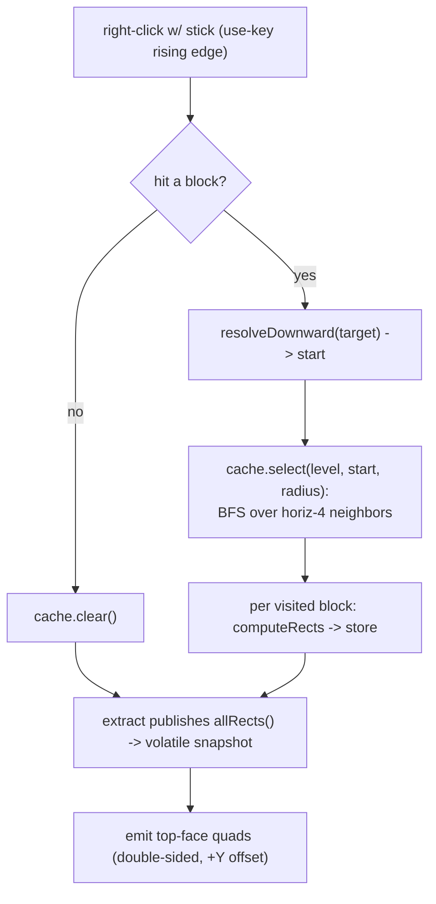

# Plan: stick trigger + standable-surface flood fill

> Current short-term plan (for execution by another agent). Durable project
> knowledge lives in [AGENTS.md](AGENTS.md); subsystem detail in
> [docs/rendering.md](docs/rendering.md).

Replace the stick **brush** with a stick **trigger**: a right-click computes a
connected standable-surface selection (the clicked block plus neighbors) in one
shot, instead of painting the hovered block every frame. The rendering path
(`StandableRect` -> `WorldOverlayManager` filled pipeline) is unchanged; only
the interaction model and the way `SurfaceCache` is populated change.

- **Today:** holding a stick brushes the hovered block into `SurfaceCache`
  every frame; right-click clears.
- **Goal:** the stick is a trigger. Right-click floods from the targeted block
  to its connected neighbors; the per-frame brushing is removed.

## Decisions

- **Connectivity:** 4 horizontal face-neighbors (N/S/E/W).
- **Order:** v1a (interaction refactor, single-block selection) -> v1b
  (horiz-4 adjacency flood) -> v2 (surface reachability + height-diff). The
  riskiest part is the interaction refactor, so it lands and is verified on its
  own before any graph traversal. v1b is where the **BFS itself** is built - a
  work queue, a visited set, and per-node depth tracking so the search
  terminates and respects `radius`; this is real code, not a free knob. v2 then
  reuses the exact same traversal and changes only the neighbor-acceptance
  predicate. The `radius` constant is just one input to that BFS.
- **v1 is a plumbing checkpoint, not a usable feature.** v1b's strict
  "neighbor non-empty at the *same* Y" rule only floods perfectly flat,
  single-elevation regions and will stop at the first slope on natural terrain.
  v2 is the first version that behaves as intended; v1a/v1b exist to validate
  the trigger, clear, render, and BFS plumbing in isolation.
- **Trigger/clear semantics** (default, easy to flip): each right-click
  **replaces** the selection by flooding from the targeted block; right-clicking
  air / no block hit **clears** it. The existing level-identity reset and
  `pruneStale` (place/break) stay. Surfaces still render only while holding the
  stick (`isVisible` unchanged).
- **Radius:** a constant (`SELECTION_RADIUS = 3`) for now; noted as future config.

## Flow

## v1a - interaction refactor (trigger, single-block selection)

Land and verify the new interaction model with **no graph traversal**, so the
riskiest plumbing change is isolated from the flood algorithm.

- [`widgets/CollisionSurfaceOverlay.java`](src/client/java/com/example/overlay/client/widgets/CollisionSurfaceOverlay.java):
  - `onUseItem`: only while holding a stick; read
    `Minecraft.getInstance().hitResult` + `level`, `resolveDownward(...)` the
    targeted block; if resolved, **replace** the selection with just that block;
    else `cache.clear()`. Keep `player.swing(hand)`. Mirrors the existing
    clear-in-`onUseItem` pattern (same main-thread cache mutation as today).
  - `extract`: drop the per-frame brush block (the `cache.add(...)` of the
    hovered block). Keep the level-identity reset, `holdingStick` flag,
    `pruneStale(level)`, and `snapshot = cache.allRects()`.
  - `isVisible` unchanged (`holdingStick && !snapshot.isEmpty()`).
- [`SurfaceCache.java`](src/client/java/com/example/overlay/client/SurfaceCache.java):
  a `select`/replace entry point that clears and stores a single resolved block
  (or extend in v1b). Keep `pruneStale`, `clear`, `isEmpty`, `allRects`,
  `computeRects`, and the `Entry` record.
- No
  [`WorldOverlayManager.java`](src/client/java/com/example/overlay/client/WorldOverlayManager.java)
  change: the use-key rising-edge dispatch (`onClientTick` -> `onUseItem`)
  already exists.

### Verify in-game (v1a)

- [ ] `./gradlew build` passes.
- [ ] Hold a stick, right-click a block: **only that block's** surface appears
  (no neighbors).
- [ ] Right-click a different block: the selection **moves** to it (replaces,
  does not accumulate).
- [ ] Right-click pointing at air / sky (no block in reach): selection
  **clears**.
- [ ] Sweep the crosshair over blocks while holding the stick **without
  clicking**: nothing is painted (the brush is gone).
- [ ] Right-click tall grass / a flower: the surface resolves to the solid block
  **below** it.
- [ ] Unequip the stick: surface hides; re-equip: it reappears (selection
  persists in memory).
- [ ] Hold the right mouse button down: it triggers **once**, the arm swings
  once (no per-tick spam).
- [ ] Break/replace the selected block: its surface updates or drops.
- [ ] Leave / change world: selection clears; no errors in the log.

## v1b - block-adjacency flood (4-horizontal, no height gating)

- [`SurfaceCache.java`](src/client/java/com/example/overlay/client/SurfaceCache.java):
  make `select(Level level, BlockPos start, int radius)` **clear**, then run a
  BFS from `start`: a work queue seeded with `start`, a **visited set** so each
  block is processed once, and **per-node depth** so the search stops at
  `radius`. For each dequeued block, enqueue its 4 horizontal neighbors at the
  **same Y** that have a non-empty collision shape and are not yet visited.
  Reuse `computeRects(...)` to store each visited block's rects. (`radius=1`
  yields direct neighbors only.)
- `CollisionSurfaceOverlay`: switch `onUseItem` to call
  `cache.select(level, start, SELECTION_RADIUS)`; add
  `private static final int SELECTION_RADIUS = 3;`.

### Verify in-game (v1b)

- [ ] `./gradlew build` passes.
- [ ] On flat ground, right-click: the clicked block **plus its 4-connected
  same-Y neighbors out to radius 3** are drawn (a diamond ~7 blocks across).
- [ ] No block beyond graph-distance 3 is selected (radius is respected).
- [ ] A 1-block step up/down or a wall **stops** the flood at that edge (the
  expected v1b limitation, fixed in v2).
- [ ] A hole / air column in the floor is **not** crossed.
- [ ] No duplicated/overlapping surfaces (visited set works) and no hang/freeze
  on a large flat area (the BFS terminates).
- [ ] Right-click air still clears; right-click a new block replaces the whole
  region.

## v2 - standable-surface reachability with max height difference

Refine only the BFS neighbor-acceptance predicate inside `SurfaceCache.select`:

- For a horizontal neighbor column, resolve its standable block (same Y, else
  walk down like `resolveDownward`) and accept the edge iff the neighbor's
  surface top height is within `MAX_STEP` (e.g. `1.0`) of the current block's
  surface top. This turns the flood into a walkable region (lets it step up/down
  one block, stops at cliffs/walls).
- Use each block's representative top (max `topY` across its rects) for the
  comparison; note the multi-sub-box simplification.
- Add `private static final double MAX_STEP = 1.0;` (or pass it in). The BFS
  graph nodes become resolved standable blocks rather than fixed-Y blocks.

### Verify in-game (v2)

- [ ] `./gradlew build` passes.
- [ ] Flood **steps across** single-block height changes (a 1-block step, a slab
  edge) continuously instead of stopping.
- [ ] Flood **stops** at a 2+ block wall / cliff (height diff > `MAX_STEP`).
- [ ] Stairs / slabs are treated as walkable continuations of adjacent ground.
- [ ] On the **same sloped terrain**, v2 covers the slope where v1b stopped
  (A/B the difference).
- [ ] Right-click air clears; replace-on-retrigger still holds.

## Docs (same PR)

- [AGENTS.md](AGENTS.md): update Milestone 3 status (stick is now a flood-fill
  **trigger**, not a brush) and acceptance checklist item 3 (replace the
  "sweeping/brush" wording with "right-click floods connected surfaces;
  right-click air clears").
- [docs/rendering.md](docs/rendering.md): update the `CollisionSurfaceOverlay` +
  `SurfaceCache` section (trigger + flood-fill, the `select` BFS, v2
  reachability/height-diff, trigger/clear semantics).
- This `PLAN.md`: refreshed per the doc-upkeep-per-PR convention.

## Risks / notes

- `26.1.2` names: confirm `BlockPos.relative(Direction)`,
  `Direction.Plane.HORIZONTAL`, `getMinY`, and the collision-shape calls against
  the resolved jars (the compiler is the oracle).
- Large radius / flat areas grow the selection; the existing
  `WorldOverlayManager` buffer resize covers vertices, but a node cap can bound
  the BFS if needed.
- Threading: flood runs in `onUseItem` (END_CLIENT_TICK) like the current
  `clear`; all cache mutation stays on the main client thread, `emit` reads the
  published `volatile` snapshot. A flood is a much heavier mutation than a
  `clear`, so **confirm `END_EXTRACTION` is not off-thread** before trusting the
  `volatile`-only handoff (if it is, move the flood into `extract` behind a
  pending-trigger flag).

## Cross-cutting checks (verify at every stage, on top of the per-stage lists)

- [ ] No errors on world load / unload or window resize.
- [ ] No per-frame brushing remains (selection only changes on right-click or
  place/break).
- [ ] The mod does nothing on a dedicated server (client-only).

## Todos

- [x] **sync**: Checkout/pull main to `6234245` and branch
  `cursor/surface-flood-fill-3c2f` off it.
- [ ] **v1a-interaction**: Replace the brush with the trigger -
  `CollisionSurfaceOverlay.onUseItem` selects only the resolved targeted block
  (clear on air-hit), drop per-frame brushing in `extract`; keep `isVisible`,
  `pruneStale`, snapshot publishing. No graph traversal yet.
- [ ] **v1a-verify**: `runClient` - confirm trigger/replace/clear-on-air work
  and the build gate passes, before adding the flood.
- [ ] **v1b-flood**: `SurfaceCache.select(level,start,radius)` BFS over 4
  horizontal same-Y neighbors (non-empty collision), depth-capped; wire
  `SELECTION_RADIUS`. Radius is validated here.
- [ ] **v1b-verify**: `runClient` - right-click floods flat ground out to
  radius; behaves as a checkpoint (stops at slopes, expected).
- [ ] **v2-reach**: `SurfaceCache.select` gates neighbor edges on
  standable-surface reachability within `MAX_STEP` (1.0) height difference.
- [ ] **v2-verify**: `runClient` - flood steps across <=1.0 height changes,
  stops at walls/cliffs.
- [ ] **docs**: Update `AGENTS.md` status + acceptance checklist,
  `docs/rendering.md`, and this `PLAN.md`.
