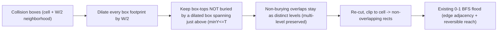

# Entity-size-aware standable surfaces (config-space dilation)

Make the standable-surface computation entity-size aware via a configuration-space
dilation (Minkowski sum with the entity's axis-aligned square), so the
point-particle flood already in place becomes correct for real hitboxes
(Player + Ravager). This is the foundation the later hole / unreturnable-space
detector consumes.

## Todos
- [ ] **profiles** - Add `EntityProfile` (Point default / Player / Ravager); active-profile field; cycle via sneak+right-click-at-nothing in `onUseItem` (clear + advance + HUD ping); replace `MAX_STEP` with `profile.reach` (1.0). Verify Point == current behavior + profile cycling.
- [ ] **rendering** - Replace distance/HSV coloring with a height-based gradient; add fixed-depth vertical skirts (region-boundary edges) so the selection reads as a 3D mesh and holes show as negative space. Done on current (pre-dilation) surfaces.
- [ ] **dilation** - One unified pass: dilate every box footprint by `W/2` over the `ceil(W/2)` neighborhood; a box-top survives where no dilated box spans immediately above it (spans-above/buried test), non-burying overlaps stay distinct levels (not max-topY). Verify gap-bridging, pillar/stair clearance, multi-level, Point == today.
- [ ] **tricky-blocks** - Verify tricky blocks + connectivity for both profiles: slab / stairs / fence / glass-pane (own-column) / wall / carpet / snow, downward resolve, sweep growth.
- [ ] **polish-docs** - Optional equal-height rect merge; update `docs/rendering.md`, `AGENTS.md` status (Milestone 4), clear `PLAN.md`.

## Why this, why now
Decision: do **hitbox collision** before hole detection. "Unreturnable" is defined
entirely relative to a specific box (its width gates what counts as a fall-in-able
hole; its upward reach gates climb-out). Building hole detection on the current
zero-width point-walker would be redone once width/reach exist. After this step
both tasks collapse to one point-particle problem on dilated surfaces.

## Core idea
Minecraft hitboxes are axis-aligned squares that never rotate, so the Minkowski
sum of a footprint with a `W x W` square is **just the rect grown by `W/2` on
every side** (square corners, no rounding). Treat the entity as a point and
pre-grow the world in **one** pass:

- **Dilate every collision box's footprint by `W/2`.**
- A box-**top** at height `T` is standable at a point `p` iff `p` is covered by
  that dilated top **and no dilated box spans immediately above `T` at `p`** (a box
  with `minY <= T < maxY`). That "spans-above" test is the occlusion / *buried*
  test.
- **Occlusion is NOT a separate "grow occluders and subtract" step** -- it falls
  out of the one rule above. An occluder is just a box that spans above some lower
  top; its **own** top is itself a (dilated) standable surface. So the single pass
  both (a) removes a lower top where a higher box now covers it (cut back by `W/2`)
  and (b) supplies that higher surface to stand on. (Support-dilation and occlusion
  are the same pass, not two stages.)
- **Why dilate *every* box (the "box method" is the clean one):** dilating
  supports and occluders alike is what collapses everything to one symmetric rule.
  The alternative -- dilate only supports and bury with *undilated* boxes -- is
  asymmetric, order-dependent (dilate-then-occlude vs occlude-then-dilate give
  different artifacts), and over-marks risers/wall bases (e.g. a `0.5` tread
  bleeding *under* the upper step), for no gain. So there is no "occluder dilation"
  to add or remove -- it is already the one pass. **Wall-proximity is not a goal**
  (only holes matter), but it falls out for free and **never affects a pure hole**
  (a hole has no tall box beside it to dilate), so we neither special-case nor
  suppress it.
- **Not `max topY`:** where two dilated tops overlap but **neither** spans the
  other (an air gap between), **both** survive as distinct levels -- a high platform
  does not erase the pit floor beneath it. This preserves multi-level / stacked
  surfaces and keeps `Point == today` (today's code uses the same spans-above test,
  just without dilation).

For a gap of width `g` flanked by support, each side grows `W/2`, leaving an
uncovered span `g - W`: `g <= W` bridges (fully covered), `g > W` leaves a hole in
the coverage -- exactly "can't fall into a hole smaller than itself" (player 0.6 ->
grow 0.3; ravager 1.95 -> grow ~0.975). The **same** growth, applied to a box that
spans above a lower top, cuts that lower surface back by `W/2` near walls/risers
and hands you the higher surface -- e.g. on a stair you stand at the full top
`1.0` over the block, and the exposed front-tread strip (depth `0.5`) is simply
**translated outward by `W/2`** (its block-front and upper-step-front boundaries
both shift back equally, so its `0.5` depth is preserved). For the player it
straddles the front edge; for the ravager the `~0.975` shift moves the whole strip
off the block into the front, as a perch lip at `0.5` (a real partial-footprint
perch; a wall in front buries it). This is just dilation, not an artifact.

## Reachability model (reversible) -- read this
The flood-filled region is the set of standable surfaces **reversibly reachable**
from the seed. An edge between two footprint-adjacent surfaces exists iff their
height difference is within the entity's reach: `|dT| <= reach`, a **single
symmetric threshold**. This is by design, not a simplification:

- Descending is always physically possible, so the **binding constraint is the
  climb back up** -> the threshold is the entity's up-reach (step/jump).
- A drop **larger** than `reach` is therefore **not** a flood edge (you could
  fall, but not climb back). It is a region **boundary** / potential fall, not part
  of the walkable set.
- So **downward is NOT infinite.** Irreversible drops are deliberately excluded
  from the flood. (An earlier "downward reach is infinite" framing was wrong --
  that would wrongly pull in places you can never return from.)

The next milestone (hole / unreturnable-space detection) builds directly on this:
a **fall** is crossing a boundary drop `> reach`, and a space is **unreturnable**
when the landing region cannot flood back up to the origin region. Keeping the
flood strictly reversible is what makes "unreturnable" well-defined.

## Locality / performance
Growth is `< 1` block even for the ravager (0.975), so influence is bounded:
- Building one cell's region needs the **3x3** column neighborhood (diagonals bleed in by `1 - 0.975`).
- Cross-surface overlap (if surfaces were kept independent) spans up to **5x5**; we avoid that by clipping each cell's result to its own bounds, keeping the flood's 4-neighbor adjacency valid.
- Window radius is **derived from `ceil(W/2)`**, never hardcoded, so a larger future profile stays correct. `select`/radius-change cost only (not per frame); negligible.

## Profiles
New `EntityProfile(name, width, reach)` (height reserved for later headroom). Ship
three, cycled in order: **Point** (`width 0`, the default), **Player**
(`width 0.6`), **Ravager** (`width 1.95`). `width 0` makes dilation a no-op, so
Point reproduces today's behavior exactly -- both the safe default and an A/B
baseline. `reach` replaces the single `MAX_STEP`: a **symmetric** threshold on
`|dT|` (see **Reachability model** -- the flood stays reversible, so this is one
value, not an up/down split). Default `1.0` to preserve current flood behavior;
tuning the exact per-profile value (e.g. a higher jump-reach) is deferred. Confirm
width constants against `26.1.2` in-game.

### Profile toggle = sneak + right-click at nothing
No keybind. The cycle piggybacks on the existing use-key dispatch (`onUseItem`):
- Right-click a **block** -> select/flood with the active profile (unchanged).
- Right-click **nothing** -> clear (unchanged).
- **Sneak + right-click nothing** -> clear **and** advance the profile (`point -> player -> ravager -> point`), then ping the HUD readout with the new profile name.

Because cycling rides on the clear path, `lastSeed` is null afterward, so there is
**no re-flood**; the new profile takes effect on the next select. (Sneak+scroll
still adjusts radius -- different input channel, no conflict.)

## Simplification: drop staleness
`pruneStale` is **removed** (not extended). It only revisited blocks already in the
map, so breaking a painted block dropped its rect but never added the
newly-exposed block beneath -- half a feature, and worse once a cell's region
depends on its neighbors. The selection now mutates **only on stick actions**
(right-click select/clear, radius scroll, profile cycle) and on the level-identity
reset. `extract` no longer prunes; it just keeps the level-reset check +
`holdingStick` flag and republishes the snapshot (publish on `select` so per-frame
work is nil). Editing painted terrain requires a re-click -- intended.

## Stages

Each stage ends with `./gradlew build` passing **and** every "Confirm in-game"
point below verified via `runClient`. **All** points in a stage must pass before
the next stage starts or the stage is committed; a green build is necessary but
never sufficient.

### Stage 1 - Profile scaffolding (no geometry change)
Work:
- Add `EntityProfile` (Point/Player/Ravager); active-profile field on `CollisionSurfaceOverlay` defaulting to Point; in `onUseItem`, when the target is nothing and the player is sneaking, advance the profile after clearing and ping `RadiusIndicatorOverlay` (extended to show the profile name). Wire `profile.reach()` in place of `MAX_STEP` (symmetric, set to 1.0 for now). Width is carried but unused until the dilation stages, so behavior is unchanged.

Confirm in-game (all required):
- [ ] Holding the stick with Point active, right-click a block: the surface selection is **identical** to the pre-change build (same rects, colors, radius behavior).
- [ ] Sneak + right-click at air (no block targeted): selection clears **and** the HUD readout shows the new profile name; repeating cycles `Point -> Player -> Ravager -> Point`.
- [ ] Plain (non-sneak) right-click at air: selection clears and the profile is **unchanged**.
- [ ] After cycling to Player then Ravager, right-click a block still selects (shape identical to Point this stage, since width is unused).
- [ ] Shift+scroll while holding the stick still changes the flood radius and shows the radius indicator.
- [ ] No errors in the log on window resize, world unload/reload, or dimension change; the selection clears on world change.
- [ ] Mod does nothing on a dedicated server.

### Stage 2 - Rendering overhaul (height color + skirts)
Done **before** dilation (on the current point-model surfaces) so the dilation
stages are verifiable with interpretable rendering. Rendering-only: geometry is
unchanged from Stage 1.

Work:
- Replace the distance/HSV tint with a **height-based gradient** (map `topY` across the selection's `[minTopY, maxTopY]` range; single color if flat) so elevation/drops are readable.
- Add **fixed-depth vertical skirts**: emit a vertical quad (double-sided, `SKIRT_DEPTH` ~0.5) dropping from each standable patch's **region-boundary** edge so the selection reads as a watertight 3D mesh and holes become obvious negative space. Skirt only boundary edges (an edge not shared with an adjacent same-height standable rect) to avoid internal walls between coplanar sub-rects; the flood's `footprintAdjacent` already gives the adjacency. Fallback if that is fiddly: skirt every rect outline at fixed depth and accept some internal walls.

Confirm in-game (all required):
- [ ] Standable surfaces are tinted by height (a stepped area shows a clear color gradient; flat ground is ~uniform).
- [ ] Each surface drops a fixed-depth skirt at the region boundary; a step reads as a riser and a drop reads as an open-sided edge, not a floating slab.
- [ ] No internal walls between adjacent same-height patches (or, with the fallback, the clutter is acceptable and noted).
- [ ] Skirts are double-sided (visible from both sides); no through-wall artifacts beyond the existing debug depth setting.
- [ ] Painted **coverage is unchanged from Stage 1** (same area; only the look changed) for all profiles.

### Stage 3 - Entity-width dilation (one unified arrangement)
Support-growth and occlusion are the **same** pass (see **Core idea**), so this is
one stage, not two.

Work:
- In `exposedSurfaces(level, pos, profile)`, gather all collision boxes in the `ceil(W/2)` neighborhood (horizontal + the vertical window), dilate **every** footprint by `W/2`, and build the per-cell arrangement clipped to the cell. A dilated box-top at height `T` survives at a sub-cell iff **no dilated box spans immediately above it** there (`minY <= T < maxY`) -- the same spans-above/buried test as today, now on dilated footprints. This both removes a lower top where a higher box covers it (cut back `W/2`) and keeps the higher top as the surface to stand on. Non-burying overlaps stay as **distinct levels** (not `max topY`), preserving multi-level and `Point == today`. Gap cells receive bled-in support from neighbors.

This shows only the **geometry** of dilation -- a `g > W` gap leaves a visible hole
in the standable coverage; a `g <= W` gap is bridged. There is **no fall/escape
semantics** yet (next milestone), so "hole in coverage" is the right framing, not
"falls in". Reach is symmetric `1.0` (see **Reachability model**): a shallow (<=1
deep) trench is reversibly reachable, so its **floor is painted too**, and it does
*not* read as a hole. To see the width rule the gap must be **deep (>=2) or over
the void** so the floor is beyond reach and nothing is painted in the middle.

Confirm in-game (all required):
- [ ] **Width / gap-bridging:** 1-wide gap **>=2 deep / over the void** -> **Player** (grow ~0.3/side) leaves ~0.4 open (visible hole); **Ravager** (grow ~0.975/side) fully bridges it (no hole). 2-wide deep gap -> **Ravager** leaves a hole. ~0.5-wide deep gap -> **Player** bridges it.
- [ ] **Edge overhang:** plateau edge standable area overhangs by ~`W/2`, visibly larger for Ravager than Player.
- [ ] **Wall clearance (free byproduct, not a goal):** a 1-tall pillar/wall on a floor pulls the **Ravager** standable region back ~`W/2` from the base (perching onto the pillar top), **Player** only ~0.3 -- confirms the unified rule works; not a targeted feature.
- [ ] **Stair:** you stand at the full top `1.0` over the block; the exposed front-tread strip (depth `0.5`) is translated outward by `W/2` -- **Player** strip straddles the front edge, **Ravager** strip sits entirely in front as a `0.5` perch lip. A wall placed in front buries the lip.
- [ ] **Multi-level preserved:** a platform over a separate lower floor (or a spiral staircase) keeps both stacked surfaces -- the higher does **not** erase the lower (no `max topY` collapse).
- [ ] **Shallow trench:** 1-deep trench floor is painted (reversibly reachable) -- *not* a hole here.
- [ ] Flat open ground: same as Point aside from the edge overhang.
- [ ] **Point** reproduces today's exact result (no overhang; occlusion + multi-level identical to current).

### Stage 4 - Tricky-block + connectivity verification (both profiles)
Work:
- Verify per-block correctness and that re-cut + own-column + `footprintAdjacent` connectivity holds across the standard block zoo.

Confirm in-game (all required; check each for **Player** and **Ravager**):
- [ ] Full block, top slab, bottom slab: top surfaces at the correct heights.
- [ ] Stairs: exposed L (Point/Player); Ravager = full top `1.0` over the block + the exposed tread strip translated outward into a front `0.5` perch lip (per Stage 3).
- [ ] Fence / wall: post-top and arm tops correct and connected through the flood.
- [ ] Glass pane sitting on a block: the pane top connects (own-column) to the exposed ring of the block below - the flood crosses between them.
- [ ] Carpet (thin) and snow layers: standable at the correct low height.
- [ ] Looking at tall grass / flowers resolves downward to the block beneath.
- [ ] Sweeping the crosshair / raising the radius grows a single connected set; all reached surfaces stay drawn.
- [ ] Right-click clears; selection persists across an item switch and reappears on re-equip; clears on world/dimension change.

### Stage 5 - Polish + docs
Work:
- Optional: merge adjacent equal-`topY` sub-rects to cut quad count. Update `docs/geometry.md` (the dilation model: unified dilated-arrangement / spans-above occlusion, locality, multi-level preservation, reversible-reachability) and `docs/rendering.md` (profiles, height coloring + skirts), `AGENTS.md` status (Milestone 4), and clear `PLAN.md`.

Confirm in-game (all required):
- [ ] If rect-merge is added, the visible selection is unchanged from Stage 4 (same coverage, fewer quads) for both profiles.
- [ ] `./gradlew build` passes; docs reviewed for staleness; `PLAN.md` cleared.

## Edge cases / risks (designed-for)
- **Occlusion is one pass, not a separate subtract**: a dilated box-top survives where no *dilated* box spans immediately above it (`minY <= T < maxY`). The spanning box's own top is itself a dilated support, so growth handles both removal of the lower top and the higher surface to stand on.
- **Not `max topY` (preserve multi-level)**: non-burying overlaps (air gap between two tops) stay as distinct levels, so a platform doesn't erase a pit floor and spiral stairs keep stacked surfaces. `Point` must stay identical to today.
- **Non-locality**: cell region depends on the `ceil(W/2)` neighbors; clip results to the cell to keep 4-neighbor flood adjacency.
- **Gap cells standable**: dilated support over a void is the perch, not a bug; flood must visit them.
- **Own-column glass-pane/fence/wall** edge must survive dilation (explicit test).
- **Stair front-tread lip**: the exposed front-tread strip (depth `0.5`) is translated outward by `W/2` (both boundaries shift equally, depth preserved); for the ravager it sits off the block as a `0.5` perch lip in front -- correct dilation, not an artifact. A wall in front spans above `0.5` and buries the lip.
- **No staleness path** (`pruneStale` removed): switching profile/radius and right-clicking re-flood from scratch; terrain edits need a re-click. Make sure profile/radius changes always re-flood from `lastSeed` so nothing reads stale point-model rects.
- **EPS/slivers** in the arrangement coordinate sweep; dedupe near-equal breakpoints.

## Deferred (explicitly out of scope here)
- Multi-cell entity-height headroom; tuning the exact per-profile `reach` value (the model stays a single symmetric threshold -- no up/down split); the actual hole / fall-trace / unreturnable classification (next milestone, built on these dilated surfaces); live terrain-edit reactivity (re-click to refresh).
- **Wall-proximity correctness is not a goal** -- only holes matter. The box method gives wall behavior for free, so we neither target nor suppress it; a wall's effect on a *nearby* hole is likewise out of scope for now.

## Files
- New: `src/client/java/com/example/overlay/client/EntityProfile.java`
- `src/client/java/com/example/overlay/client/SurfaceSelection.java` (dilate every box footprint by `W/2` + unified spans-above arrangement/clip over the `ceil(W/2)` neighborhood, multi-level preserved; `select`/`exposedSurfaces` take a profile; **remove `pruneStale`**)
- `src/client/java/com/example/overlay/client/widgets/CollisionSurfaceOverlay.java` (active profile, sneak+clear cycle in `onUseItem` + HUD ping, pass profile, optional rect merge; **drop the `extract` `pruneStale` call**, publish snapshot on `select`)
- `src/client/java/com/example/overlay/client/widgets/RadiusIndicatorOverlay.java` (show profile name)
- `src/client/java/com/example/overlay/client/OverlayClient.java` -- likely **no change** (profile cycle lives in `onUseItem`; existing scroll handler stays)
- Docs: `docs/geometry.md`, `docs/rendering.md`, `AGENTS.md`, `PLAN.md`
