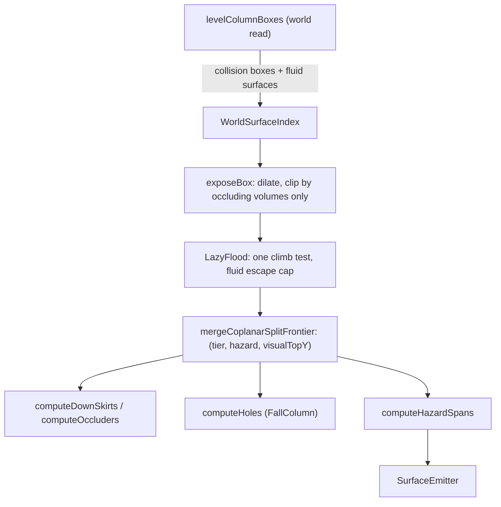

# PLAN

The current plan, committed so it can be handed between agents and machines through git
(cloud agent to local dev agent). Work runs one step at a time: each step carries its own
enumerated in-game checklist, is validated in-game, and is its own commit (see
[`AGENTS.md`](AGENTS.md) → Stage-gating). The **Status** lines say where the work stands.
Durable knowledge lives in `docs/`, so this file is cleared once the plan lands.

# M9 hazards — water and lava as swimmable hazard surfaces

Give water and lava standable fluid surfaces (behind a manual toggle) so pools
stop reading as false holes, with a fluid-specific climb ceiling reproducing the measured
escape out of a pool, and hazard-colored fill plus perimeter beams marking it.

## The model

A fluid cell contributes **a standable surface and no collision volume**; hazard
identity lives on that fluid surface alone. Everything else follows from the existing
rect/flood machinery.

- **Surfaces without volume — the governing rule.** Occlusion here is a property of
  **collision volume**: burial (`yMin <= T`) and headroom (`yMin < T+H`) both ask what
  solid spans above a top. A fluid supplies a surface and no volume, so its box offers a
  standable top and nothing else, and every solid top in the world survives a fluid
  overhead. Solid boxes clip a fluid top exactly as they clip any other top. Once
  created, a fluid surface travels the same path as a block's surface — dilation,
  clipping, flood, merge, skirts, holes — and fluid-specific logic is confined to
  **creation**: which cells emit a box, at what height, and the `0.4` threshold. This is
  a general primitive, a **non-occluding support surface**, whose intended later
  instances are scaffolding and climbables (see the backlog).
- **The column ladder is a consequence, not a feature.** Because a fluid box never
  occludes, the top of *every* fluid cell survives exposure, so a fluid column is a
  stack of standable planes exactly `1.0` apart — within every profile's reach. The
  pool floor therefore connects to the surface and the shore by the ordinary climb test,
  and a waterfall is climbable the same way, with no rule saying anything about water.
- **Why the first pass failed.** It gave the box a clip role with the buried term only.
  Both occlusion terms are volume tests, so the box still deleted the solid top inside
  its cell — and the headroom term alone would do it anyway (`yMax = y+0.778 > y`,
  `yMin = y < y+1.8`), which is why no thin-box variant rescues it. The measured symptom
  was a flowing sheet with adjacent `6/9` and `7/9` cells: the `7/9` box removed the
  floor beneath it, so the `6/9` cell's rim had nothing below it and read as `HOLE`.
  Recorded here because the invariant is easy to re-break: a fluid is a surface, and
  only volumes occlude.
- **Edges against a fluid are ordinary drops.** An edge with no volume facing it stays a
  drop span, and the drop classifier decides it the usual way — a reached surface
  strictly below, across the fall column, is a landing. The kept floor is that landing at
  a `6/9 | 7/9` step, and the plane one cell down is that landing in deep water, so
  fluids need no edge-coverage rule of their own. Marking "a solid faces this rim" stays
  the occluder pass's job.
- **Which fluids.** Detection is keyed on the vanilla `FluidTags.WATER` /
  `FluidTags.LAVA` tags, one shared `swimmableFluids` toggle. Fluids outside those tags keep today's
  behavior, so modded fluids are out of scope (a modded fluid that opts into a vanilla
  tag comes along for free).
- **One box per fluid cell.** Enabled tag → full-footprint fluid surface, `yMin = y`,
  `yMax = y + fluidSurfaceHeight` — `getHeight` when above `0.4`, else `0`; tagged `WATER`
  or `LAVA`; `occludes=false`. Falling included.
- **The `0.4` rule seats thin fluid at the cell floor.** Above `0.4` the fluid surface
  sits at `getHeight`; at or below it the fluid surface sits at relative height `0`
  (coplanar with the solid underfoot). Hazard priority over that solid at the same
  `collisionTopY` is Step 2.
- **Hazard identity lives on the fluid surface.** Only the fluid box carries a
  `HazardClass`; solids stay `NONE`. Thin sheets get a floor-height fluid surface so they
  carry the fluid hazard over the solid underfoot.
- **Escape lives in the climb test.** When the lower surface of a pair is fluid
  (`HazardClass.isFluid()`) and the higher is not, the budget is capped at
  `collisionTopY + 1/9 + escape` (Step 3);
  climbing to another fluid keeps the plain reach, which is what leaves the column ladder
  intact. `escape` is the thickest rim a mob leaves the fluid onto, measured from the
  fluid **block** top — the same number an in-game measurement produces (water `6/16`) —
  and the `1/9` is the still-fluid assumption that converts it to a height above the
  plane, so fluid height stays out of the arithmetic.
- **Planes stay at the physical fluid surface.** `collisionTopY = visualTopY =
  y + fluidHeight`, so every pass downstream of the flood (drops, skirts, holes) reads a
  real height.
- **Fluids connect** across rivers. Cost tracks water volume inside the hop budget —
  Step 1 gates on measurement; deferred knob is a fluid-hop cap.
- **Fluid identity through the merge.** Ownership `(radiusTier, hazardPriority, visualTopY)`
  — hazard priority separates water/lava and lets a thin fluid surface claim over solid.
- **One hazard enum is the extension point.** `HazardClass { NONE, WATER, LAVA }` keys
  the color and the merge priority; the escape height is one value shared by all
  fluids.
- **Marking.** Hazard fill color + perimeter `HazardSpan` beams.

## Step 1 — Fluid surfaces stop occluding

Most of `500b3b7` stands: `FluidKind`, `boolean swimmableFluids` threaded through
`select` → `LazyFlood` / `computeHoles` / `gatherLedges`, `fluidKind()`,
`FLUID_JUMP_THRESHOLD`, the `WorldBox` fluid fields with their convenience constructors,
box emission in `WorldGeometry.levelColumnBoxes`, the pure
`fluidSurfaceHeight(kind, fluidHeight, reach)` predicate, the Generic toggle in
[Configs.java](src/client/java/dev/kelianmao/mobwalk/client/config/Configs.java)
(`swimmableFluids` on) with its re-flood callback and
`Configs.swimmableFluids()`, the three `select` call sites in
[CollisionSurfaceOverlay.java](src/client/java/dev/kelianmao/mobwalk/client/surface/CollisionSurfaceOverlay.java),
and the `comment.*` keys in
[en_us.json](src/client/resources/assets/mobwalk/lang/en_us.json).

The corrections:
1. `WorldBox.occludes` (renamed from fluidPlate): solids set `occludes=true`; fluid
   surfaces set `occludes=false`. `exposeBox` skips clip when `!occludes`.
   Zero-thickness alone still headroom-occludes.
2. Drop solid-under-fluid tainting — only the fluid surface carries `FluidKind`.
3. Thin fluid (`<= 0.4`) emits a fluid surface at relative height `0`.
4. Invert clip-contract tests that assumed burial; add shore complementarity; thin-at-0
   fluid-surface tests.

Keeps the plane **at the fluid surface** for tall fluid (`yMax = y + fluidHeight`), or at
the cell floor for thin fluid; Step 3 seats escape. A pond paints multiple layers
(surface, intermediates, floor).

In-game checklist (unit tests cover fluid-surface heights, clip role, column continuity):
1. Deep pond with a flush shore, click the shore → water surface paints across the pond,
   floor/intermediate planes are reached, rim is a plain down-skirt (no red hole beams).
2. Thin flowing sheet (water far from source, or Overworld lava's last ring) → a
   floor-height fluid surface paints coplanar with the stone underfoot.
3. Configure → General → `swimmableFluids` Off → pond re-floods as hole beams; On → water
   paints again.
4. Dry-terrain selection unchanged from before this step.
5. `./gradlew build` green.

## Step 2 — Carry fluid identity through the merge

a `fluid` field on
[StandableRect.java](src/client/java/dev/kelianmao/mobwalk/client/surface/StandableRect.java)
(defaulted in the convenience constructors), set from the source box in `exposeBox`, and
`OwnershipClass` / `ownershipLayers` / `stripMergeEqualOwnership` in
[RectMath.java](src/client/java/dev/kelianmao/mobwalk/client/surface/RectMath.java)
extended to `(tier, hazardPriority, visualTopY)`, ordering by
`FluidKind.priority()` so a new kind slots in without touching the partition algorithm.
`logFloodDebug` prints the tag. Tests extend `MergeContractTest` / `PriorityPartitionTest`.

In-game checklist (unit tests cover merge ownership / partition invariants):
1. Step 1 pond picture unchanged (no new seams).
2. `/mobwalk dump` on that pond → `fluid=WATER` on water planes only; solids stay
   `fluid=NONE`.
3. Water abutting lava at the same height → two separate regions in the dump.
4. `./gradlew build` green.

## Step 2 note (HazardClass)

`FluidKind` deleted. `HazardClass` (NONE/WATER/LAVA + `priority()`) is end-to-end on
`WorldBox` / `StandableRect` / merge ownership / dump (`hazard=`). `FluidTags` map at
world read. Checklist: dump shows `hazard=WATER` on water, `hazard=NONE` on solids;
water|lava abut → separate regions; Step 1 pond picture unchanged; build green.

## Step 3 — Fluid escape in the climb test, and its setting

Measured in-game: a mob paths out of water onto a rim up to `6/16` thick and stops at
`7/16` (unlit campfire), well short of what a player manages with an active jump. That
escape is modelled as **a cap inside the climb test** on fluid-to-solid pairs, rather
than by moving any plane.

- The whole rule is one predicate over two rects, `ClimbRule.climbs(a, b)`: take the
  lower by `collisionTopY`, give it a budget of `lower.collisionTopY() + reach`, and when
  the lower `isFluid()` and the upper is not, cap that at
  `lower.collisionTopY() + FLUID_SURFACE_DROP + fluidEscape`; the edge exists iff the
  higher's `collisionTopY` is at or below the budget. One undirected edge with the lower
  supplying it, so *reachable is escapable* is untouched.
- `FLUID_SURFACE_DROP = 1/9` is the still-fluid assumption made concrete: a source sits
  `8/9` up its cell, so adding `1/9` back turns the setting (a rim height above the
  fluid **block** top) into a height above the plane the rect actually carries. That is
  what keeps the predicate a pure function of two `StandableRect`s — no source block, no
  fluid height, nothing new on the node.
- **The cap binds only when the target is non-fluid**, which is what leaves the fluid column
  on the ordinary reach: consecutive planes sit `1.0` apart, far past any escape
  height, so a pool floor and a waterfall stay connected exactly as in Step 1. It does
  bind for **every** fluid rect rather than surface cells alone, so a submerged plane
  cannot route around the surface plane's limit at a low setting; a shelf inside the
  water column is still reached from the plane above it, where the solid is the lower
  rect.
- Taking the cap as a `min` against `collisionTopY + reach` keeps leaving a fluid no
  easier than jumping on land, and is what keeps the existing
  `collect(cx, cz, h - reach, h + reach)` candidate window a valid superset, so the
  window is unchanged. It also covers the thin sheet, whose plane is a full block below
  the rim it is nominally measured against — and the solid it flows over is an exposed
  coplanar rect on the plain reach anyway.
- `ClimbRule(reach, fluidEscape)` is built once per `select` from the profile and the
  setting and handed to `LazyFlood` and `assignOriginWave`, so the pure layer stays free
  of config reads and testable on plain doubles. `OriginProbe` gains a `HazardClass`
  (`buildClickProbes` emits a probe per box in the clicked cell, fluid surfaces
  included).
- For a `NONE`/`NONE` pair the new test is exactly what the window already enforced, so
  dry terrain is bit-identical and the existing suite is the regression gate.
- `reach` drops out of the world read — `WorldGeometry.levelColumnBoxes` and
  `fluidSurfaceHeight` lose the parameter they reserved for seating.

One Generic setting supplies `fluidEscape` for every fluid, alongside the single
`swimmableFluids` toggle: `fluidEscapeHeight`, a `ConfigDouble` in blocks over
`[0, 2]` defaulting to `0.375` (`6/16`), with the `floodRadius` live-apply → re-flood
callback and a `comment.*` key in
[en_us.json](src/client/resources/assets/mobwalk/lang/en_us.json) naming the two anchors
(`0.375` mob pathing, `0.875` onto soul sand) and that a value at or above the profile's
vertical reach makes leaving fluid the same as jumping on land. `logFloodDebug` prints it
next to `reach=`.

New `FluidEscapeTest` covers the budget for each pair of hazard kinds, the land clamp, the
`6/16` pass and `7/16` reject from a source-height plane, `climbs` symmetry (same verdict
whichever order the pair is passed), a fluid-to-fluid pair `1.0` apart connecting at any
escape setting (the column ladder), a solid-to-fluid pair keeping the plain profile
reach, a submerged plane granting no more than the surface plane above it, and a thin
sheet climbing out at full reach through the solid it flows over.

In-game checklist (unit tests cover the budget formula, the clamp, symmetry, and the
column ladder):
1. Deep still pool, rim one level above the water ringed with **4-layer snow** (collides
   `6/16`; its outline is `8/16`, so with `drawOnVisibleFace` on the paint sits above the
   collision top) → click the pool floor: the water column, the snow ring, and the
   terrain past it all paint.
2. Same rim as **unlit campfires** (`7/16`) → click the pool floor: water paints, the
   campfire ring stays unpainted, the water rim carries hole beams.
3. Same rim as **full blocks** → ring unpainted with hole beams at the rim; click the
   ring instead → water stays unpainted.
4. **Flush shore** (shore top level with the water block top) → shore, water, and the
   terrain past it paint as one connected region.
5. **Waterfall** down a cliff into the pool → click the pool floor: the falling column
   paints from the pool up to its source.
6. Configure → General → `fluidEscapeHeight` `0.875` → a soul-sand (`14/16`) ring
   paints while the full-block ring still fails; `2.0` → the full-block ring paints.
7. Dry cliff / stair / trench selection unchanged from Step 2.
8. `./gradlew build` green.

Lava: re-check items 1–4 on a lava pool with a Warden before treating this step done. If
lava turns out to want a materially different height, splitting the setting per hazard
is the follow-up.

## Step 4a — Hazard fill colors (+ settings)

`SurfaceEmitter` colors hazard-tagged rects (and their skirts) from the fluid's hazard
color instead of `walkableColor`, so open water reads as water rather than as walkable
ground. Precedence, highest first: frontier grey → Debug `shadeByDepth` hue → hazard
Color4f (if that kind’s show is on) → `walkableColor`. Each hazard is a show+color pair
like holes (`showHoleBeams` + `holeBeamColor`): Appearance `showWaterHazard` /
`waterHazardColor`, `showLavaHazard` / `lavaHazardColor`. Show off keeps the surface
drawn but uses `walkableColor` (hazard identity unchanged for merge / dump / escape).

`emit` hoists one `FillColors` (walkable + both shows + both hazard colors) per frame and
passes it into `emitSkirts` — skirts share the tops’ fill decision. `SkirtSpan` carries
`HazardClass` (like `depth` / `frontier`); `SpanGroupKey` includes hazard so WATER|LAVA
UP skirts do not coalesce across kinds.

In-game checklist (unit tests cover skirt hazard stamp / merge separation):
1. Deep pond, click floor → water planes and their skirts paint from `waterHazardColor`;
   dry shore past a flush rim stays walkable green.
2. Lava pool → lava planes paint from `lavaHazardColor`.
3. Configure → Appearance → `showWaterHazard` Off → pond fill uses walkable green
   (surfaces still drawn); On → hazard color returns. `showLavaHazard` Off leaves water
   hazard-colored.
4. Change `waterHazardColor` → pond updates without re-select; change `walkableColor` →
   dry ground retints, water stays on its color when shown.
5. Debug `shadeByDepth` On → water/lava use depth hues; Off → hazard colors return when
   shown. Cutoff ring still greys when shown.
6. Dry cliff / stair selection fill unchanged from Step 3. Hole beams at unreachable pool
   rims stay `holeBeamColor` (no new perimeter hazard beams).
7. `./gradlew build` green; cross-cutting: `runClient` clean, world load/unload and
   resize OK.

## Step 4b — Hazard perimeter beams

A new `HazardSpan` record plus a pure `computeHazardSpans(mergedRects)` in
`SurfaceSelection` (a hazard-rect edge sub-span with no same-fluid rect across it,
frontier skipped) is published as another `volatile` snapshot by
`CollisionSurfaceOverlay`. In
[SurfaceEmitter.java](src/client/java/dev/kelianmao/mobwalk/client/surface/SurfaceEmitter.java),
`emitHoles` is factored into one beam emit (spans + color + toggle + the
`showBeamsThroughWalls` buffer choice) that holes and hazards both call — the
generalization done at its second use rather than in advance. Beam draw gated by the
same `showWaterHazard` / `showLavaHazard` (no separate `showHazardBeams`); beam color
from the matching hazard color. `HazardSpanTest` covers interior-seam suppression and
perimeter coverage. Dump gains a `hazards=` block. Fluid-under-fall hole-beam recolor
folds in here if still wanted.

In-game checklist (unit tests cover perimeter span geometry):
1. Pond → blue fill and blue perimeter beams; pool interior clear of beams.
2. Lava pool → orange fill and orange perimeter beams.
3. `showWaterHazard` Off → water beams gone, water fill uses walkable green; lava
   unchanged.
4. Dry-cliff hole beams unchanged.
5. `./gradlew build` green.

## Representation contracts (stated now, tested in the step that introduces them)

Each invariant gets a named paragraph in `docs/` plus a contract test, matching the
existing `MergeContractTest` / `LedgeExposureContractTest` / `TerrainEdgeContractTest`
pattern. The wording lands in the docs when that step's checks pass (docs come last
within a step); the concrete case tables are written during the step.

1. **Surface existence** (Step 1, `FluidPlaneTest`). A cell emits at most one fluid
   box when its kind is enabled; top is `y + getHeight` when height `> 0.4`, else `y + 0`
   (thin sheet). Pure `fluidSurfaceHeight(...)`.
2. **Fluid role** (Step 1, `FluidClipContractTest`). A fluid box supplies a standable top
   and clips nothing (`occludes=false`): neighbouring lower solid keeps full dilated area
   under Ravager, solid beneath keeps full area, floor keeps headroom. Solid shore clips
   the fluid top by `W/2` — complementarity at a flush pond rim.
3. **Column continuity** (Step 1, `FluidPlaneTest`). Within a fluid column, consecutive
   standable surfaces differ by at most `1.0` — plane to plane exactly `1.0`, and the
   lowest plane one block above the floor — so every profile's reach connects the column
   top to bottom.
4. **Merge identity fidelity** (Step 2, `MergeContractTest`). `collisionTopY` stays the
   sole partition key and fluid identity is an ownership axis only, so the three durable
   merge invariants hold unchanged, plus: each output rect's tag equals those of the
   nodes it covers, and mixed-identity nodes at one collision height still emit disjoint
   rects.
5. **Tag coverage** (Step 2, `FluidPlaneTest`). The fluid surface carries the kind; solids
   stay `NONE`. Thin sheets use a height-0 fluid surface (hazard priority claims over
   solid in Step 2).
6. **Escape cap** (Step 3, `FluidEscapeTest`). A pair's budget is
   `lower.collisionTopY() + profile.reach()`, further capped at
   `lower.collisionTopY() + 1/9 + fluidEscape` when the lower
   `HazardClass.isFluid()` and the higher is not. `climbs` gives the same verdict whichever order the pair is passed and always
   spends the lower rect's budget, so every edge stays undirected and *reachable is
   escapable* holds. The cap is confined to fluid-to-non-fluid pairs, so consecutive planes in
   a fluid column stay connected for every profile at every setting value.

Doc homes: a new "Fluid surfaces" section in [docs/geometry.md](docs/geometry.md) for
1–3 and 6, its merge-contract paragraph for 4–5, and the color precedence in
[docs/rendering.md](docs/rendering.md). The non-occluding support surface primitive is
named in [docs/geometry.md](docs/geometry.md) alongside contract 2, since scaffolding and
climbables inherit it.

## Settled decisions

- **A fluid is a surface, not a volume.** Occlusion belongs to collision volumes, so a
  fluid box offers a top and every solid top under a fluid survives.
- **The column ladder is a consequence of that**, not a feature with its own rule: with
  nothing occluding, every cell's top survives and the climb test does the rest.
- **Edge marking stays with the occluder pass.** An edge with no volume facing it is a
  drop, and the drop classifier's landing test decides it — fluids get no coverage rule
  of their own.
- **Falling fluid emits like still fluid.** Downward push unmodelled.
- **Manual toggle, no roster field.** One Generic `swimmableFluids` (on by default) for
  vanilla water and lava, rather than a `lavaImmune` column on the profile roster.
- **One Generic escape-height setting** covers every fluid, matching the single
  `swimmableFluids` toggle. A setting rather than a constant because the true value is
  uncertain and the useful range spans two different questions — `0.375` answers "where
  will a mob go", `0.875` and up answers "where can one physically get" — and that is the
  user's call, not the code's.
- **Escape is measured from the fluid block top**, so the setting is the rim height an
  in-game test produces. One constant (`1/9`, the still-fluid surface drop) converts it
  to a height above the plane, which keeps fluid height out of the arithmetic and the
  climb test a pure function of two rects.
- **One climb test, one undirected edge.** The escape is a per-node ceiling spent by the
  lower surface rather than a directed rule, so the pair stays unordered and the merge,
  origin wave, and skirt passes keep working unmodified. Two surfaces connect when the
  lower can climb to the higher; a descent is described by hole classification.
- **Vanilla water and lava only**; other modded fluids keep today's behavior.
- **Fluids connect** across rivers rather than terminating the flood.
- **Wading is not modelled** as a depth rule; the vanilla `0.4` fluid-jump threshold
  covers the one case where a mob jumps from the floor instead of swimming.

## Limitations to record in the docs

- One escape height covers every fluid and every profile. At its default it models
  **AI pathing** rather than physical capability, so a rim the mod calls unreachable can still
  be left by a mob that is pushed, knocked back, or ridden — and vanilla wardens avoid
  pathing into lava despite their immunity (MC-249415), so an enabled lava plane says
  "it can cross", not "it will". Raising the setting moves the model back toward
  capability.
- The escape height is measured on **still** water and converted to a height above the
  plane by a fixed `1/9`, the drop from a cell top to a source's surface. Whether mob
  pathing changes with flow level is unverified, so a shallower flowing cell gets that
  same budget above its own plane.
- A pool whose rim sits more than the escape height above the water block top is
  outside the connected region entirely, so it stays unpainted and its rim reads as a
  hole beam. That is the accurate verdict for a mob that falls in, at the cost of the
  "the trap is water" cue — and at the mob-pathing default it is the **common** case
  (any pool dug into terrain), so coloring such a beam by the fluid found under its fall
  column is worth folding into Step 4b.
- The reached set now includes the water volume and the seafloor under it, so a click
  near open water spends its hop budget on water where it used to spend it on land. The
  cap on consecutive fluid hops is the knob if that trade goes the wrong way.
- Flow push is not modelled — a stream carries a mob downstream, and a waterfall pushes
  them down, possibly somewhere the geometry says they chose to go.
- Fluid planes are flat per cell, matching the physics (fluid height is a per-block
  scalar); vanilla renders flowing cells as an interpolated slope, so the paint can sit
  up to `1/9` above or below the visible surface at a slope. Modelling the slope would
  break the axis-aligned-rect invariant for a sub-block cosmetic gain.
- Drowning is not modelled; a water plane is traversable, not survivable.

# M9 hazards

- exists: holes
- generalize visual marker (beam for all hazards?)
  - generalize settings. enable + color for all
- magma
- soul sand
  - need to how collision works. does only part of the hitbox need to be touching to be slowed? in which case, need to use full dilated rect
  - extension: effects through 0.5 blocks
- water, lava
  - walkable water
- (maybe) fall damage
- not in scope: non-collision hazards (powdered snow, berry bushes, fire)

## Ideas / backlog
- Chunked / multi-tick flood so it doesn't stutter.
- Auto update (eg flood from feet every N ticks)
- Hazards
- Settings tooltip UX pass (tone/length).
- Probably out of scope:
  - ladders/vines
  - scaffolding
  - non-collision hazards (eg berry bushes)
  - fall damage
- Definitely out of scope:
  - horizontal velocity when jumping (ie parkour)
  - pathfinding
