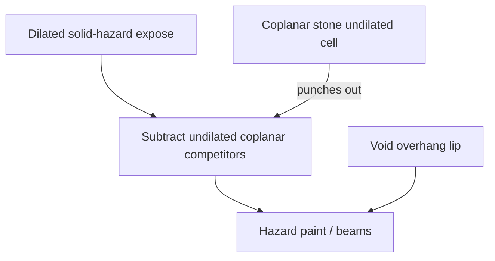

# PLAN

The current plan, committed so it can be handed between agents and machines through git
(cloud agent to local dev agent). Work runs one step at a time: each step carries its own
enumerated in-game checklist, is validated in-game, and is its own commit (see
[`AGENTS.md`](AGENTS.md) → Stage-gating). The **Status** lines say where the work stands.
Durable knowledge lives in `docs/`, so this file is cleared once the plan lands.

**Status:** Milestone 10

# Solid hazards: coplanar center attribution (soul sand + magma)

## Concept (read this first)

**Walkability vs block effect are different questions — and the effect rule is not “always undilated.”**

Walkability: *can any part of my hitbox rest on this support?* → entity as a point, dilate supports/occluders by `W/2` (unchanged).

Vanilla solid block effects (soul sand slow, magma damage), checked in-game:

1. **Several coplanar walkable supports** (magma flush with stone) → effect follows the **center**: center over stone ⇒ no magma, even if the hitbox still overlaps magma.
2. **Only one supporting collision** (standing on magma at a cliff, center overhanging void) → hazard **still applies**. The center is outside the block, but there is no coplanar rival under the center, so the block you are standing on keeps the effect.

So solid-hazard paint is **not** “undilated core only” and **not** “full dilated expose like fluids.” It is:

**`hazard_paint = dilated_hazard − ∪(undilated footprints of coplanar competing supports)`**

- Lip over a coplanar neighbor’s cell → punched out (`NONE` / neighbor).
- Lip over void / no coplanar support under that point → **stays hazard** (non-compete).
- Occlusion still runs first (soul sand beside a taller full block): buried neighbor clips standable before this punch.

**Chosen wiring: explicit coplanar punch, then ordinary merge.** After dilated expose, guillotine-subtract undilated coplanar competitor footprints from each solid-hazard top; keep remainder rects tagged `SOUL_SAND` / `MAGMA`; discard subtracted pieces. Coverage of that XZ stays with the competitor’s dilated standable. Then normal `SOUL_SAND` / `MAGMA` / fluid / `NONE` merge.

Do **not** add `UNDILATED_NONE` or a new merge ownership axis to encode the abstract stack — same paint, worse merge coalescing. Merge-only stacks are fine as intuition; implement the punch. **Do not micro-optimize locality/cost up front** — column-local gather is the natural fit next to `exposeBox`, but chase further only if in-game lag shows up.

Fluids stay fully dilated: standing on the fluid top *is* the condition.

Fluids stay fully dilated: standing on the fluid top *is* the condition.

**Scope lock:** soul sand + magma only. No half-block/carpet “effects through,” powder snow, fire, berry bushes. Soul sand **visible-face** height stays orthogonal to hazard identity.

**Visualization:** fill + perimeter beams + per-hazard show/color settings (fluid UX). Solids stay `occludes=true`, `isFluid() == false`.

**Ownership / merge:** strip-merge only same `HazardClass`. After the punch, `MAGMA` may include void-side dilated lips, so a cliff-edge magma rect can extend past the block; the stone-side edge still meets `NONE` at the **block** boundary. Same kind merges (2×2 magma). Priorities: `SOUL_SAND(3)`, `MAGMA(4)`; fluids stay 1/2.

**Three geometries (drives tests):**

| Setup | Same `collisionTopY`? | Hazard footprint |
|-------|----------------------|------------------|
| Magma \| stone (coplanar `T = 1`) | Yes | Dilated magma **minus** stone’s undilated cell → hazard stops at **block edge** on the stone side (center over stone). |
| Magma cliff (void on one side) | N/A (no competitor) | Full **dilated** hazard on the void side — tint/beams spill `W/2` past the block over empty space. |
| Soul sand \| full block (`T = 14/16`, neighbor `yMax = 1`) | No | Neighbor **occludes** first; hazard = surviving standable after clip (cut back ~`W/2` from the wall), then coplanar punch if any. Not a full soul-sand square against the wall. |

---

## What changes in the model

1. **World read** stamps soul sand / magma on solid `WorldBox`es (block identity). Collision/outline/occlusion unchanged.
2. **Expose dilates** as today. For each solid-hazard top, **coplanar punch** = guillotine-subtract undilated footprints of **other coplanar supports** (same `collisionTopY`, not same solid-hazard class — stone/`NONE`, and any other rival support if coplanar; magma|magma do not punch each other). Keep only remainder subrects, still tagged `SOUL_SAND` / `MAGMA`; discard subtracted pieces. Coverage of that XZ stays with the competitor’s dilated standable already in the set.

   **Not a global NONE×hazard pass** and **not** an `UNDILATED_NONE` merge class. Gather competitor undilated XZ from nearby columns while exposing each solid-hazard box (same neighbourhood `exposeBox` already touches). Fine-tune only if lag shows up.
3. Flood / merge / skirts / holes consume the result; climb ignores non-fluids.
4. **`HazardBeams`** on post-punch solid-hazard rects (stone-side beam on block edge; void-side beam on dilated rim; soul sand on occlusion-trimmed edge).
5. **Draw + settings** like water/lava.

**Test design rule:** each check must fail under the wrong model — (a) full dilated like fluids on magma\|stone, or (b) pure undilated core that clears void overhangs. No yes-man smoke.

---

## Planning cadence (decision)

**Keep this overall plan simple; detail each step only when starting it.**

- **This plan** is the durable handoff: concept, paint rule, chosen wiring (explicit punch), step goals, failure-mode tests, in-game checklists, out of scope.
- **Before implementing a step**, write a short temp plan (CreatePlan / scratch) with file-level touch list and any API choices — then execute that step only.
- Do **not** expand all four steps into full implementation designs here up front (they go stale; Step 1 carries most design risk and is already specified geometrically).

**Every step is a complete commit:** code → `./gradlew build` / tests → in-game checklist → docs for what that step landed → human approval → one commit (code + docs together). No docs-only trailing step; no “logic now, docs later” across commits.

---

## Implementation steps (commit-per-step)

### Step 1 — Stamp + coplanar punch — **done**

Landed: `HazardClass.SOUL_SAND` / `MAGMA`, world-read stamp, post-expose coplanar
punch, `SolidHazardPunchTest`, geometry docs. Crouch borders follow punch; fill
still walkable-colored until Step 2.

### Step 2 — Fill draw + settings

Wire fill + Appearance show/color + lang keys (soul sand brownish, magma orange-red, show on).

**In-game checklist:**

1. Magma \| stone → tint seam at the **shared block edge**; Player vs Point does **not** grow tint onto stone.
2. Magma cliff → tint **spills** ~`W/2` over void.
3. Soul sand against full blocks → tint on remaining top only; `drawOnVisibleFace` still controls height.
4. Show off → solid-hazard tints disappear.
5. Build gate: `./gradlew build` passes.

**Docs in this commit:** [`docs/rendering.md`](docs/rendering.md) fill precedence; [`docs/settings.md`](docs/settings.md) show/color options (lang keys author-owned).

**Done when:** checklist + docs + human says commit.

### Step 3 — Perimeter beams for solid hazards

Extend [`HazardBeams`](src/client/java/dev/kelianmao/mobwalk/client/surface/HazardBeams.java) to soul sand/magma on post-punch rects.

**Unit tests:** magma\|stone → stone-side beam on block edge (`x = 1`); magma cliff → void-side beam near `1+halfW`; 2×2 → no interior beam; soul sand\|wall → occlusion-trimmed edge.

**In-game checklist:**

1. Magma in stone → beams match tint (block perimeter on stone sides).
2. Magma cliff → void-side beam on **dilated** rim; coplanar sides on block edge.
3. 2×2 magma → outer perimeter only.
4. Soul sand against wall → beam follows cut-back tint edge.
5. Build gate: `./gradlew build` passes.

**Docs in this commit:** [`docs/rendering.md`](docs/rendering.md) beams; [`docs/project.md`](docs/project.md) status; finish [`PLAN.md`](PLAN.md) backlog cleanup for soul sand/magma.

**Done when:** checklist + docs + human says commit.

---

## Explicitly out of scope

- Effects through half-blocks / carpets / snow layers
- Generalizing beyond soul sand + magma
- Non-collision hazards (fire, powdered snow, sweet berry bushes)
- Changing dilation for walkability or fluid hazards
- Premature performance work beyond a natural column-local punch

## Ideas / backlog
- Chunked / multi-tick flood so it doesn't stutter.
- Auto update (eg flood from feet every N ticks)
- Hazards (remaining after M10: generalize markers/settings, walkable water, maybe fall damage; extension: effects through 0.5 blocks)
- Settings tooltip UX pass (tone/length).
- Probably out of scope:
  - ladders/vines
  - scaffolding
  - non-collision hazards (eg berry bushes)
  - fall damage
- Definitely out of scope:
  - horizontal velocity when jumping (ie parkour)
  - pathfinding
