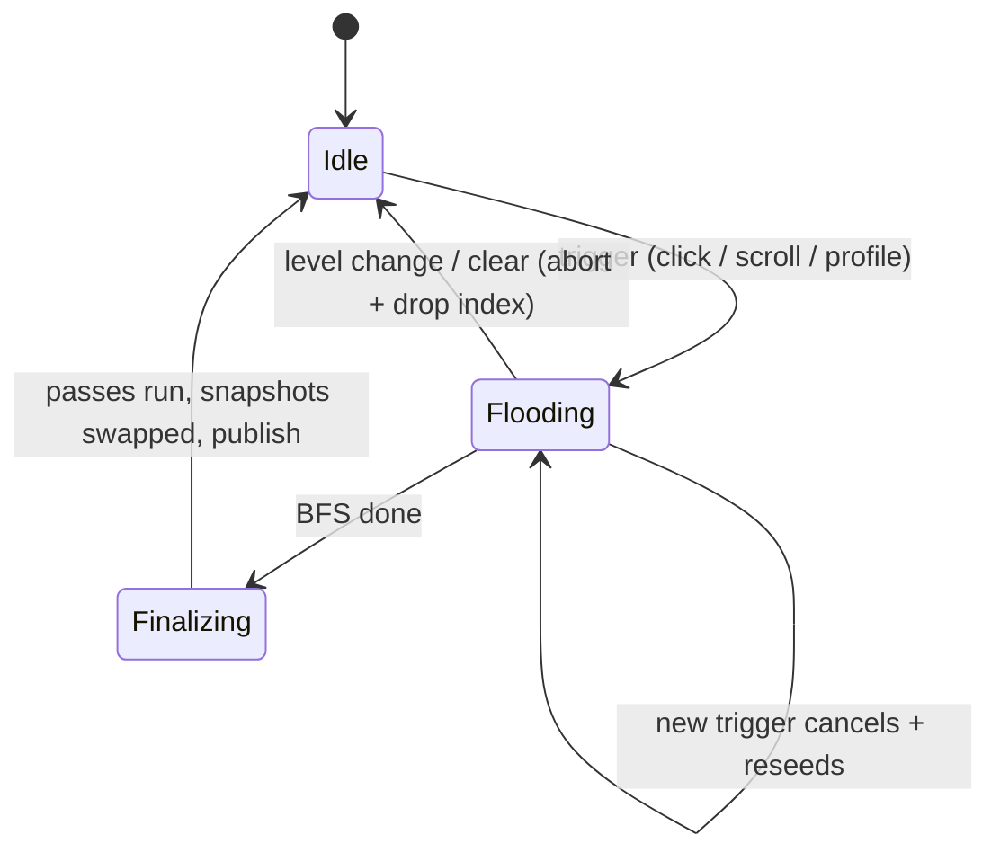

# Multi-tick chunked flood — design evaluation

This is an **evaluation**, not an approved build. It maps the current pipeline, the design forks with recommendations, the interface surface, the concrete bugs to guard, and a stage-gated step breakdown.

## 1. What it must solve

`SurfaceSelection.select(...)` runs the whole pipeline synchronously on the client thread: [`SurfaceSelection.java` L254-294](src/client/java/dev/kelianmao/mobwalk/client/surface/SurfaceSelection.java). One call does the BFS (`LazyFlood.run()` [L896-973](src/client/java/dev/kelianmao/mobwalk/client/surface/SurfaceSelection.java)) then five post-passes (merge inside `run`, then `OccluderSkirts`, `DownSkirts`, `HoleBeams`, `HazardBeams`). On open ground the reached set grows `~radius²` (radius up to 30), so a single click — or a single radius-scroll tick — can freeze a frame. Backlog item: `PLAN.md` "Chunked / multi-tick flood so it doesn't stutter." The rapid-fire case (shift+scroll radius, which re-floods every scroll tick via `reselectWithMobProfile` [L173-181](src/client/java/dev/kelianmao/mobwalk/client/surface/CollisionSurfaceOverlay.java)) is the worst offender and the strongest motivation.

## 2. Threading model (the fundamental fork)

- **Recommended — cooperative time-slicing on the client thread.** Each client tick, advance the flood by a bounded budget, then yield; resume next tick until done. The per-tick driver (`advanceFlood()`) belongs in `WorldOverlayManager.onClientTick` (already registered on `ClientTickEvents.END_CLIENT_TICK` [L111-125](src/client/java/dev/kelianmao/mobwalk/client/overlay/WorldOverlayManager.java)). This keeps all world reads (`WorldGeometry.levelColumnBoxes` → `level.getBlockState`/`getCollisionShape`) on the main thread, honoring the current "not thread-safe by design; world reads only on the client thread" contract ([`SurfaceSelection.java` L70-73](src/client/java/dev/kelianmao/mobwalk/client/surface/SurfaceSelection.java), [rendering.md Threading](docs/rendering.md)).
- **Rejected — background worker thread.** The flood is *output-sensitive/lazy*: it reads the live `ClientLevel` as it expands (`WorldSurfaceIndex.ensureRows`). Reading `ClientLevel` off-thread while the main thread ticks the world risks `ConcurrentModificationException`/chunk-unload crashes. Making it safe would need a full thread-safe world snapshot up front — which is exactly the expensive, non-lazy work chunking exists to avoid. Off-thread contradicts the architecture; do not pursue.

## 3. What gets chunked

The pipeline has two phases with different chunkability:

- **Phase 1 — the BFS (`LazyFlood.run` loop L934-963).** Naturally incremental: a `queue` + `hopCount` visited map + `reached`/`reachedDepths` lists + the `WorldSurfaceIndex`. This is the dominant `O(R²)` cost and the slice target.
- **Phase 2 — finalize (merge L965-972, then `OccluderSkirts`/`DownSkirts`/`HoleBeams`/`HazardBeams`).** Runs over the whole reached disk, `O(R²)`. `HoleBeams.compute` also reads the world (`gatherLedges`), so it too must stay on the main thread.

**Decision — expand whole depth rings until a wall-time budget is spent, yielding only at ring boundaries.** The chunk unit is a hop-ring; the budget is wall-clock. Each tick `advanceFlood()` expands whole rings back-to-back, checks elapsed time after each ring (a cheap `~R`-times cadence — no per-node `nanoTime`), and yields once elapsed passes the threshold (e.g. ~2 ms). Yields land only on completed rings, never mid-ring, so early cheap rings pack many into one tick while the expensive outer rings take a tick or more each. Today's synchronous `select` is the `∞`-time case ("every ring at once"). Ring-aligned yielding keeps every yield point a completed ring, so a slice is a valid flood at radius `d` and can be drawn per slice later if wanted (§4). The BFS is never re-run — one monotonic queue.

## 4. What shows during the multi-tick compute

**Decision — keep the previous selection visible until the final swap; finalize once at completion.** `isVisible()` (which requires `!snapshot.isEmpty()` [L128-131](src/client/java/dev/kelianmao/mobwalk/client/surface/CollisionSurfaceOverlay.java)) stays true across the compute; the new snapshot replaces it atomically when the last ring is done and the single finalize (`O(R²)`) has run. Because yields land only on completed rings, frontier labeling and hole classification are always computed on a valid set.

Per-slice draw is kept **available** by the ring-aligned yielding (a completed ring `reached{≤d}` with the ring relabeled frontier equals a real flood at radius `d`). It stays off in v1: publishing each ring means finalizing per ring (`Σ O(d²) = O(R³)`), and drawing unmerged tops double-blends into dark seams. The point of ring alignment is to leave that door open, not to walk through it now.

## 5. Implementation sketch

- **Make the BFS resumable, ring at a time.** Promote `LazyFlood` from a per-`select` throwaway into a stateful job (e.g. `FloodJob`) whose `queue`/`hopCount`/`reached`/`reachedDepths`/`surfaces` are fields, plus `boolean stepRing()` that expands exactly the current depth's nodes (seeding the next ring) and returns done-ness.
- **One completion path, two drivers.** `stepRing()` is the unit; reaching the empty queue triggers a single **`finish()`** — run the Phase-2 passes, build the new immutable lists, reference-swap `result`/`occluders`/`downSkirts`/`holes`/`hazards`, and `publish()`. Two ways to get there: `advanceFlood()` (per-tick, calls `stepRing()` until the wall-time budget is spent, always finishing the ring in progress) reaches it over several ticks; `runToCompletion()` (`while(!stepRing()){}` then `finish()`) reaches it in one blocking call, reproducing today's exact synchronous result. `SurfaceSelection` holds the active job across ticks; `select(...)` becomes an **arm/seed** ("cancel any job, build a fresh one seeded from the origin wave", returns immediately — no expansion, no finalize), except the unlimited-budget (`0`) case where `select` just calls `runToCompletion()`.
- **Drive it from the overlay.** `CollisionSurfaceOverlay` gets a per-tick `advanceFlood()` called from the manager tick (§2). `onUseItem`/`reselectWithMobProfile` arm a job instead of blocking; `publish()` happens inside `finish()`. (Per **tick**, not per frame: `ClientTickEvents` fires a fixed 20/s regardless of FPS, so flood speed doesn't scale with framerate.)
- **Bundle the published outputs into one immutable `SelectionSnapshot`.** The five computed lists (`result`/`occluders`/`downSkirts`/`holes`/`hazards`) already travel as a group through the `all*()` getters, `publish()`, `emit()`, `SurfaceEmitter.emit(...)`, and `dumpFloodDebug`. Packaging them into one record makes `finish()`'s swap a **single `volatile` reference write**, so the render thread never reads a torn mix (new rects + old holes). Behavior-preserving, so it lands as the precursor step (step 0) before the flood changes.
- **Data-structure split (reuses today's three layers).** The in-progress flood accumulates only in the job's own processing state — `queue`/`hopCount`/`reached`/`reachedDepths` + `WorldSurfaceIndex`, promoted from throwaway-local to persistent fields. Processing vars stay on the `FloodJob`; per-frame input flags (`crouching`, `visible`) stay separate overlay fields. The previously published `SelectionSnapshot` stays untouched for the whole compute — no in-place mutation of a list the render thread may iterate — and `finish()` swaps the one reference. This extends the existing "replace wholesale + immutable snapshot" handoff; it does not change it.
- **Cancel/restart rules (latest-wins).** Any new trigger (re-click, radius scroll, profile/fluid/visible-face change) cancels the in-flight job and starts fresh. The level-identity reset in `extract` [L113-122](src/client/java/dev/kelianmao/mobwalk/client/surface/CollisionSurfaceOverlay.java) and `clear()`/`clearSelectionForSoftDisable()` must also abort the job and drop its `WorldSurfaceIndex` (memory).
- **`/mobwalk dump` reads persisted state (no fresh `select`).** The published `result` + passes already persist after a flood, and if the pre-merge `reached` list is retained on completion, `dumpFloodDebug` [L290-306](src/client/java/dev/kelianmao/mobwalk/client/surface/CollisionSurfaceOverlay.java) just logs the persisted selection. If a flood is mid-flight when dump fires, drain that same in-flight job to completion first (reuse persisted state, not a recompute), then log.

## 6. Possible bugs / risks

- **Slicing must not change the result — for a fixed world state.** The core invariant: over an unchanging world, the output is independent of slice granularity (one ring per `advanceFlood` vs all rings at once). This is pinned by the **slice-granularity invariance** test (§8, new-code vs new-code — no retained old code) plus the existing output-contract tests for behavior-vs-today. The one case it does **not** hold is a live world edit mid-flood, the accepted divergence in the mutation bullet below — the flood now spans ticks, so reads captured at different ticks can see different states.
- **Finalize only on the complete set.** Merge frontier is `depth == limit` (`mergeCoplanarSplitFrontier`) and hole classification reads reached-set membership, so both are only valid once the BFS has finished. The baseline (§4) finalizes once at completion, so this is satisfied by construction. (A *completed depth ring* would also be valid — it equals a flood at radius `d` — but the baseline never publishes mid-flood, so the only thing to guard is: never finalize a jagged mid-ring wavefront.)
- **Finalize stays one-shot (out of current scope).** Only the BFS is chunked; the single finalize (`O(R²)`, incl. `HoleBeams` world reads) runs inside `finish()`. If it turns out to hitch at high `R` on hole/hazard-heavy terrain, slicing its per-edge passes into a multi-tick `Finalizing` phase is a **future follow-up**, not part of this plan.
- **`/mobwalk dump` mid-flight** reads the previous selection unless it drains the in-flight job first (§5) — and the pre-merge `reached` list must be retained on completion or the dump's "reached" section is empty.
- **Radius-scroll thrash** — must be strict latest-wins cancel; chunking actually *helps* (never pays a full flood per scroll tick).
- **World mutation mid-flood — no invalidation, no backtracking (by design).** The `WorldSurfaceIndex` is append-only: once a `(column,row)` is scanned it is never re-read, and there is no block-change listener. So a mid-flood edit to an already-scanned column is unseen while a column scanned after it reads the new state — a blend of old/new geometry. The BFS stays **monotonic/forward-only** (bits only set, queue only advances), so a world change never triggers a re-scan or rewind. This is deliberate: invalidating a scanned column on a block event is exactly what would force downstream re-expansion (backtracking), so we accept staleness instead, under the existing "editing painted terrain needs a re-click" policy (today's synchronous `select` is already a point-in-time snapshot; chunking only widens the window to ~R ticks). **Chunk unload / level change mid-flood** is the non-staleness case: level/dimension change aborts the job; a plain chunk unload makes reads return empty so the flood just stops expanding there (no crash, no backtrack).
- **Lifetime/memory.** Cross-tick BFS state + index must be released on cancel/abort/level-change.
- **Re-entrancy/ordering.** `onUseItem` and `advanceFlood()` both run in `onClientTick`; a click landing the same tick as an `advanceFlood()` must not step a half-cancelled job.
- **Fat ring can overrun the wall budget.** Because a ring is processed whole (no mid-ring yield), one very wide ring can exceed the time threshold in a single tick — the wall budget caps how many rings per tick, not the cost of the ring in progress. On open ground the ring is the circumference (`~8d`, ~240 columns at `R=30`) so this is rare; accepted for the simplicity of ring-only yielding.
- **Wall-time non-determinism, contained.** The threshold decides how many rings land per tick, never the result (BFS is resumable and order-independent per depth). So the invariance test drives `stepRing()` directly (no clock); production uses the time threshold.

## 7. Interface (settings / GUI)

- **Mostly invisible** — success is the absence of stutter, so keep the surface minimal.
- **Budget is a per-tick wall-time threshold** checked at ring boundaries — an internal constant, no user knob. It is sized against the **frame budget** (~16.7 ms at 60 FPS), not the 50 ms tick period: `advanceFlood` runs once per tick on the render thread, so its spend lands on one frame. A few ms (e.g. ~2 ms) keeps that frame smooth; higher finishes in fewer ticks but risks a shallow hitch.
- **No separate on/off flag — "synchronous" is just an unlimited budget.** The budget *is* the toggle: `0` (sentinel for unlimited) makes `select` drain the whole flood in one call via the same `runToCompletion()` the dump uses, reproducing today's exact synchronous behavior; any finite value chunks. So an escape hatch / A-B comparison is one budget value, not a `chunkedFlood` boolean. If ever surfaced in Debug it is a single integer (budget ms, `0` = synchronous), added via the `Configs.Debug` + `OPTIONS` + `apply(DEBUG_KEY)` + `comment.*` recipe ([settings.md](docs/settings.md)).
- **Optional progress cue** — low priority. Because the old selection stays drawn until the swap (§5), a high-radius re-click gives no feedback, so a subtle cue has real value. **Gate it on duration** (show only after a flood runs past ~250 ms / ~5 ticks) so fast floods never flash it. Ring flooding already knows progress (`d` vs `R`); prefer an **indeterminate spinner** (no misleading fill — work is `~d²`, so linear-in-`d` would stall near the edge; use area fraction `d²/R²` if a percentage is wanted). Start by reusing `RadiusIndicatorOverlay` (HUD, near crosshair, already fade-gated) for near-free `"flooding…"` text; a cursor-anchored radial wheel is a nicer variant needing custom arc drawing.
- No changes to General options; `floodRadius`, profile, fluid, and visible-face callbacks keep working, just landing over a few ticks.

## 8. Stage-gated steps (each its own commit + in-game checklist)

Per [AGENTS.md](AGENTS.md) stage-gating, each step is validated in-game before commit. Proposed order (full checklists in the todos):

1. **`selection-snapshot`** — bundle the five outputs into one immutable `SelectionSnapshot` (behavior-preserving precursor).
2. **`resumable-bfs`** — `LazyFlood` → stateful `FloodJob` with `stepRing()`; lands with the unit tests below.
3. **`tick-driver-baseline`** — `select` becomes arm/seed; per-tick `advanceFlood()`; `finish()` swap; latest-wins cancel + level-change abort; dump reads persisted state. (The actual stutter fix.)
4. **`settings-and-polish`** — budget as a single Debug integer (`0`=synchronous); optional duration-gated progress cue.

**Tests — check contracts, keep no old code, and don't restate the algorithm.** Behavior-preservation vs today is guarded by the **existing output-contract tests** (`SurfaceGeometryTest`, `MergeContractTest`, `DropClassificationTest`, …): they already pin expected flood *outputs* for known inputs, so the refactor just has to keep passing them — no old-vs-new comparator, no retained old code. The **new** tests (pure, on a synthetic `ColumnBoxes`; wall-time stays in-game-validated) assert only invariants that later steps depend on, new-code vs new-code:

- **Ring/depth-batching** — on a hand-built world, after `k` `stepRing()` calls the reached set is exactly the surfaces at `depth ≤ k` (checked against hand-computed per-depth membership). This is the contract step 3's ring-only yielding rests on.
- **Slice-granularity invariance** — one-ring-per-`stepRing` vs unlimited-in-one-call give identical final output (both are the *new* code at different budgets): "where you yield never changes the result."
- **Cancel/reseed statelessness** — seed → advance partway → cancel → seed(new params) equals seed(new params) from scratch: output depends only on current params, no leftover-state bleed.

## Ideas / backlog
- Chunked / multi-tick flood so it doesn't stutter.
- Auto update (eg flood from feet every N ticks)
- Probably out of scope:
  - ladders/vines
  - soul sand through 0.5 blocks
  - non-collision hazards (eg berry bushes)
  - fall damage
- Definitely out of scope:
  - horizontal velocity when jumping (ie parkour)
  - pathfinding
