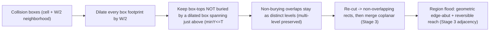

# Entity-size-aware standable surfaces (config-space dilation)

Make the standable-surface computation entity-size aware via a configuration-space
dilation (Minkowski sum with the entity's axis-aligned square), so the
point-particle flood already in place becomes correct for real hitboxes
(Player + Ravager). This is the foundation the later hole / unreturnable-space
detector consumes.

## Todos
- [x] **profiles** (Stage 1) - `EntityProfile` (Point default / Player / Ravager); active-profile field; sneak+right-click-at-nothing cycle in `onUseItem` (clear + advance + HUD ping); `profile.reach()` replaces `MAX_STEP`; `pruneStale` removed (publish-on-action). **Done + committed.**
- [x] **rendering** (Stage 2) - Replaced distance/HSV coloring with a height-based gradient; added **depth-tested** vertical skirts (a second pipeline) at depth `reach + margin` (~2), drawn on the **current unmerged** point-model rects. Skirt every edge; depth-testing hides solid-backed/buried skirts. Skirts fade to transparent over their bottom half; each rect is **dilated outward by `SKIRT_OFFSET` for drawing only** so tops meet their skirts and neighbors overlap (no seams). Dropped the distance plumbing. **Done.**
- [x] **merge + adjacency** (Stage 3) - `select` reworked to **enumerate → merge → flood**: enumerate `exposedSurfaces` over a spatial window of `radius` blocks, merge coplanar footprint-adjacent rects into maximal rects (greedy strip-merge X then Z), then flood the merged graph by one **geometric adjacency** rule (`footprintAdjacent && |dTopY| <= reach`). Dropped `collectColumn`/own-column/4-neighbor + the 0-1 BFS/block-keyed cache; the glass-pane link folds into geometric adjacency. **Radius is now a spatial block budget** (not merged-hop-count). Skirts ride on merged rects. **Done.**
- [x] **rendering polish** (Stage 2.5, after Stage 3) - Reverted the Stage 2 draw-time dilation: tops/borders draw at **true bounds** (overlapping translucent tops double-blend into seams); only **square skirts** are nudged out by a tiny `SKIRT_OFFSET` (0.002) purely to dodge z-fighting the terrain face. Added a **grey cutoff ring** (surfaces in the last block before the radius cutoff blend toward grey, `sqrt`-eased; `fadedTop` splits each top at the ring lines so a long rect doesn't smear the fade). **Crouch-gated the debug aids**: through-walls tops + the opaque borders only render while sneaking; otherwise the top is depth-tested. **Done.**
- [ ] **dilation** (Stage 4, WIP — builds, not yet in-game-verified) - One unified pass: dilate every box footprint by `W/2`, gathering occluders over a **`ceil(W)`** margin beyond the window (not `ceil(W/2)` — both candidate and occluder grow `W/2`, so a wall up to `W` blocks out still trims; fixes outer-ring/`radius=0` under-trim); a box-top survives where no dilated box spans immediately above it (spans-above/buried test), non-burying overlaps stay distinct levels (not max-topY). **Reuses Stage 3 region adjacency** (no per-cell-clip hack). Added since the parked WIP: (a) a **re-cut to non-overlapping union** (`SurfaceSelection.union`, vertical-slab sweep) per coplanar level *before* the greedy merge — dilated neighbor tops overlap and would double-blend / leave the merge ill-defined; (b) renderer **skirt-diff** (`CollisionSurfaceOverlay.openSpans`/`subtractSpans`) so a merged level the partition split into slivers doesn't draw skirts on its *internal* equal-height edges (false interior walls). Verify gap-bridging, pillar/stair clearance, multi-level, Point == today, no double-blend, no false interior skirts.
- [ ] **tricky-blocks** (Stage 5) - Verify tricky blocks + connectivity for both profiles: slab / stairs / fence / glass-pane / wall / carpet / snow, downward resolve, sweep growth.
- [ ] **polish-docs** (Stage 6) - update `docs/geometry.md` + `docs/rendering.md`, `AGENTS.md` status (Milestone 4), clear `PLAN.md`.

## Why this, why now
Decision: do **hitbox collision** before hole detection. "Unreturnable" is defined
entirely relative to a specific box (its width gates what counts as a fall-in-able
hole; its upward reach gates climb-out). Building hole detection on the current
zero-width point-walker would be redone once width/reach exist. After this step
both tasks collapse to one point-particle problem on dilated surfaces.

## Core idea
Minecraft hitboxes are axis-aligned squares that never rotate, so the Minkowski
sum of a footprint with a `W x W` square is **just the rect grown by `W/2` on
every side** (square corners, no rounding). Treat the entity as a point and
pre-grow the world in **one** pass:

- **Dilate every collision box's footprint by `W/2`.**
- A box-**top** at height `T` is standable at a point `p` iff `p` is covered by
  that dilated top **and no dilated box spans immediately above `T` at `p`** (a box
  with `minY <= T < maxY`). That "spans-above" test is the occlusion / *buried*
  test.
- **Occlusion is NOT a separate "grow occluders and subtract" step** -- it falls
  out of the one rule above. An occluder is just a box that spans above some lower
  top; its **own** top is itself a (dilated) standable surface. So the single pass
  both (a) removes a lower top where a higher box now covers it (cut back by `W/2`)
  and (b) supplies that higher surface to stand on. (Support-dilation and occlusion
  are the same pass, not two stages.)
- **Why dilate *every* box (the "box method" is the clean one):** dilating
  supports and occluders alike is what collapses everything to one symmetric rule.
  The alternative -- dilate only supports and bury with *undilated* boxes -- is
  asymmetric, order-dependent (dilate-then-occlude vs occlude-then-dilate give
  different artifacts), and over-marks risers/wall bases (e.g. a `0.5` tread
  bleeding *under* the upper step), for no gain. So there is no "occluder dilation"
  to add or remove -- it is already the one pass. **Wall-proximity is not a goal**
  (only holes matter), but it falls out for free and **never affects a pure hole**
  (a hole has no tall box beside it to dilate), so we neither special-case nor
  suppress it.
- **Not `max topY`:** where two dilated tops overlap but **neither** spans the
  other (an air gap between), **both** survive as distinct levels -- a high platform
  does not erase the pit floor beneath it. This preserves multi-level / stacked
  surfaces and keeps `Point == today` (today's code uses the same spans-above test,
  just without dilation).

For a gap of width `g` flanked by support, each side grows `W/2`, leaving an
uncovered span `g - W`: `g <= W` bridges (fully covered), `g > W` leaves a hole in
the coverage -- exactly "can't fall into a hole smaller than itself" (player 0.6 ->
grow 0.3; ravager 1.95 -> grow ~0.975). The **same** growth, applied to a box that
spans above a lower top, cuts that lower surface back by `W/2` near walls/risers
and hands you the higher surface -- e.g. on a stair you stand at the full top
`1.0` over the block, and the exposed front-tread strip (depth `0.5`) is simply
**translated outward by `W/2`** (its block-front and upper-step-front boundaries
both shift back equally, so its `0.5` depth is preserved). For the player it
straddles the front edge; for the ravager the `~0.975` shift moves the whole strip
off the block into the front, as a perch lip at `0.5` (a real partial-footprint
perch; a wall in front buries it). This is just dilation, not an artifact.

## Reachability model (reversible) -- read this
The flood-filled region is the set of standable surfaces **reversibly reachable**
from the seed. An edge between two footprint-adjacent surfaces exists iff their
height difference is within the entity's reach: `|dT| <= reach`, a **single
symmetric threshold**. This is by design, not a simplification:

- Descending is always physically possible, so the **binding constraint is the
  climb back up** -> the threshold is the entity's up-reach (step/jump).
- A drop **larger** than `reach` is therefore **not** a flood edge (you could
  fall, but not climb back). It is a region **boundary** / potential fall, not part
  of the walkable set.
- So **downward is NOT infinite.** Irreversible drops are deliberately excluded
  from the flood. (An earlier "downward reach is infinite" framing was wrong --
  that would wrongly pull in places you can never return from.)

The next milestone (hole / unreturnable-space detection) builds directly on this:
a **fall** is crossing a boundary drop `> reach`, and a space is **unreturnable**
when the landing region cannot flood back up to the origin region. Keeping the
flood strictly reversible is what makes "unreturnable" well-defined.

## Locality / performance
Growth is `< 1` block even for the ravager (0.975), so influence is bounded:
- Building one cell's region needs the **3x3** column neighborhood (diagonals bleed in by `1 - 0.975`).
- With the **Stage 3 region adjacency** (surfaces are rects in space, abutment is a geometric edge test — not the rigid 4-column scan), dilation no longer needs to clip each result back to its own cell to "keep 4-neighbor adjacency valid." Dilated rects (including a perch over the void that straddles cells) flood directly. Cross-surface influence still spans up to **5x5**, bounded by `ceil(W/2)`.
- Occluder margin (boxes gathered **beyond** the window so the outer ring trims correctly) is **`ceil(W)`**, never hardcoded, so a larger future profile stays correct. NB: it is `ceil(W)`, **not** `ceil(W/2)` — both a candidate top and an occluder grow by `W/2`, so a box up to `W` blocks past the window still eats into an outer candidate (the early `ceil(W/2)` under-trimmed wide entities like the Ravager). `select`/radius-change cost only (not per frame); negligible.

## Profiles
New `EntityProfile(name, width, reach)` (height reserved for later headroom). Ship
three, cycled in order: **Point** (`width 0`, the default), **Player**
(`width 0.6`), **Ravager** (`width 1.95`). `width 0` makes dilation a no-op, so
Point reproduces today's behavior exactly -- both the safe default and an A/B
baseline. `reach` replaces the single `MAX_STEP`: a **symmetric** threshold on
`|dT|` (see **Reachability model** -- the flood stays reversible, so this is one
value, not an up/down split). Default `1.0` to preserve current flood behavior;
tuning the exact per-profile value (e.g. a higher jump-reach) is deferred. Confirm
width constants against `26.1.2` in-game.

### Profile toggle = sneak + right-click at nothing
No keybind. The cycle piggybacks on the existing use-key dispatch (`onUseItem`):
- Right-click a **block** -> select/flood with the active profile (unchanged).
- Right-click **nothing** -> clear (unchanged).
- **Sneak + right-click nothing** -> clear **and** advance the profile (`point -> player -> ravager -> point`), then ping the HUD readout with the new profile name.

Because cycling rides on the clear path, `lastSeed` is null afterward, so there is
**no re-flood**; the new profile takes effect on the next select. (Sneak+scroll
still adjusts radius -- different input channel, no conflict.)

## Simplification: drop staleness (done in Stage 1)
`pruneStale` **was removed** (not extended) in Stage 1. It only revisited blocks
already in the map, so breaking a painted block dropped its rect but never added
the newly-exposed block beneath -- half a feature, and worse once a cell's region
depends on its neighbors. The selection now mutates **only on stick actions**
(right-click select/clear, radius scroll, profile cycle) and on the level-identity
reset. `extract` no longer prunes; it just keeps the level-reset check +
`holdingStick` flag, and the snapshot is published on each stick action (so
per-frame work is nil). Editing painted terrain requires a re-click -- intended.

## Stages

Each stage ends with `./gradlew build` passing **and** every "Confirm in-game"
point below verified via `runClient`. **All** points in a stage must pass before
the next stage starts or the stage is committed; a green build is necessary but
never sufficient.

### Stage 1 - Profile scaffolding (no geometry change) -- DONE (committed)
Work:
- Add `EntityProfile` (Point/Player/Ravager); active-profile field on `CollisionSurfaceOverlay` defaulting to Point; in `onUseItem`, when the target is nothing and the player is sneaking, advance the profile after clearing and ping `RadiusIndicatorOverlay` (extended to show the profile name). Wire `profile.reach()` in place of `MAX_STEP` (symmetric, set to 1.0 for now). Width is carried but unused until the dilation stages, so behavior is unchanged. (`pruneStale` removed; snapshot published on each stick action.)

Confirm in-game (all required):
- [x] Holding the stick with Point active, right-click a block: the surface selection is **identical** to the pre-change build (same rects, colors, radius behavior).
- [x] Sneak + right-click at air (no block targeted): selection clears **and** the HUD readout shows the new profile name; repeating cycles `Point -> Player -> Ravager -> Point`.
- [x] Plain (non-sneak) right-click at air: selection clears and the profile is **unchanged**.
- [x] After cycling to Player then Ravager, right-click a block still selects (shape identical to Point this stage, since width is unused).
- [x] Shift+scroll while holding the stick still changes the flood radius and shows the radius indicator.
- [x] No errors in the log on window resize, world unload/reload, or dimension change; the selection clears on world change.
- [x] Mod does nothing on a dedicated server.

### Stage 2 - Rendering overhaul (height color + depth-tested skirts) -- DONE
Done **before** merge/dilation (on the current **unmerged** point-model surfaces)
so the later stages are verifiable with interpretable rendering. Rendering-only:
geometry and the flood are unchanged from Stage 1.

Work:
- Replace the distance/HSV tint with a **height-based gradient** (map `topY` across the selection's `[minTopY, maxTopY]` range; single color if flat) so elevation/drops are readable. Remove the now-unused `distance`/`DistancedRect` plumbing.
- Add a **second, depth-tested render pipeline** for skirts in `WorldOverlayManager` (built from `DEBUG_FILLED_SNIPPET` with the snippet's default depth state, *not* disabled), with its own buffer; `emit` writes into **two** buffers -- depth-off **fill** (tops + borders, keep drawing through walls for debug) and depth-on **skirt**. Confirm the `26.1.2` builder depth API against the resolved jars.
- Emit a **double-winding vertical skirt** dropping `SKIRT_DEPTH = profile.reach() + SKIRT_MARGIN` (~2 for these profiles; a named constant that scales with reach) from **every** rect edge. Depth-testing occludes skirts buried behind solid geometry, so a step reads as a riser, a real drop reads as an open wall, and interior skirts on a **solid-backed** floor vanish for free. (Why depth, not culling: depth hides buried skirts from every angle; we settled this in design.)

Why every edge and not boundary-only: with depth-testing the interior skirts on
solid-backed floors self-hide, so the plan's old "skirt only region-boundary
edges" test is unnecessary here. The remaining clutter case -- a **thin platform
over air**, whose interior shared-edge skirts hang in the gap -- is cleaned up by
the Stage 3 merge, not by a boundary-edge test.

**Seam fix (draw-time dilation):** skirts initially showed seams -- a single
rect's top didn't reach its offset skirt (horizontal ring gap), and adjacent
rects emitted coincident skirts on their shared edge (z-fighting). Fixed by
**dilating each rect outward by `SKIRT_OFFSET` (0.01) for drawing only** -- top,
border, and skirts all use the grown bounds. A rect's top then meets its own
skirts exactly, and neighbors overlap (their interior skirts are pushed into the
neighbor and depth-occluded) instead of sharing a coincident edge. Renderer-only
and independent of the real Stage 4 width dilation. Skirts also fade to
transparent over their bottom half so a deep drop doesn't read as a hard
floating wall.

**Known limitation (accepted):** a **translucent** solid block (glass, etc.)
doesn't write depth, so it does **not** occlude the depth-tested skirt -- the
skirt shows through it. Left as-is; not worth special-casing here.

Confirm in-game (all required):
- [x] Standable surfaces are tinted by height (a stepped area shows a clear color gradient; flat ground is ~uniform).
- [x] Each surface drops a ~2-deep skirt; **depth-tested**: buried/riser-backed skirts are hidden, open-drop skirts are visible. A step reads as a riser; a cliff edge reads as an open wall, not a floating slab.
- [x] **Tops still draw through walls** (debug depth-off unchanged); **skirts do NOT draw through terrain** (except translucent blocks -- see known limitation).
- [x] Interior skirts on a **solid-backed** flat floor are depth-hidden (no grid of internal walls). A **thin platform over air** may still show interior walls -- expected, fixed in Stage 3.
- [x] Painted **coverage is unchanged from Stage 1** (same area, modulo the 0.01 draw-time dilation; only the look changed) for all profiles.
- [x] No seams: no top-to-skirt gap on isolated rects, no seam/z-fight between adjacent painted blocks.
- [x] Cross-cutting: no errors on resize/world change; server no-op.

### Stage 3 (NEW) - Surface merge + neighbor-detection rework -- DONE
Move from a per-block-column flood to **surfaces-as-rects-in-space with geometric
adjacency**, and merge coplanar adjacent surfaces into maximal rects. This is the
representation both rendering (clean skirts) and dilation (non-column-aligned
rects, perches over the void) need, so the two changes are grouped here.

Work:
- **Neighbor-detection rework:** replace `collectColumn` / the own-column case / the rigid 4-horizontal-neighbor candidate collection with a **geometric adjacency** test: two standable rects are flood-adjacent iff their footprints share an edge with positive overlap (`footprintAdjacent`, kept) **and** `|dTopY| <= reach`. The glass-pane/fence/wall "own-column" vertical link **folds into** this (the partial block's footprint edges abut the exposed ring of the block below), so the special case is removed.
- **Merge:** union coplanar (`|dTopY| < EPS`) footprint-adjacent rects into maximal rectangles (greedy: merge along one axis within equal extents, then merge those strips). Merged rects feed both the snapshot (rendering + skirts) and the flood's node set.
- **Open sub-decisions — RESOLVED in-game:**
  - *Radius semantics:* chose the **spatial block-distance budget** (window half-extent) over merged-hop-count — after merge an open floor is one rect, so hop-count reaches the whole plane in one hop (useless on open ground). Straight-line reach still matches Stage 2; the cutoff is now a Chebyshev square, not a taxicab diamond (accepted in-game as "good enough for now").
  - *Enumeration vs. laziness:* went with the **Proposed** path — enumerate `exposedSurfaces` over the radius-derived window, merge, then flood the merged graph from the seed rect.

Confirm in-game (all required):
- [x] **Coverage parity:** for **Point**, the reachable *set* is the same as Stage 2 -- merge/adjacency change only the rect *grouping* (and the cutoff shape: square not diamond), never which surfaces are reachable.
- [x] **Clean skirts:** adjacent same-height patches render as merged rects -- skirts only around the merged outline, **no internal walls even over air** (the thin-platform case from Stage 2 is now clean).
- [x] **Glass pane on a block** still connects to the block-below ring -- now via geometric adjacency (no own-column special case).
- [x] Stair tread<->top, fence post/arms, slab/carpet/snow heights still connect and paint as before; downward resolve still works.
- [x] Sweeping the crosshair / changing radius still grows a **single connected set**; radius behaves sensibly under the spatial-budget semantics.
- [x] Cross-cutting: no errors on resize/world change; server no-op.

### Stage 2.5 - Rendering polish (done after Stage 3) -- DONE
A rendering-only follow-up (an extension of the Stage 2 overhaul, but landed
after Stage 3 since it builds on the merged rects). Geometry / flood unchanged.

Work:
- **Reverted the Stage 2 draw-time dilation.** Offsetting the translucent tops
  made adjacent rects double-blend into visible seams. Tops **and** borders now
  draw at the **true rect bounds**; only the **skirts** are pushed out, by a tiny
  `SKIRT_OFFSET` (0.002, square -- not splayed/trapezoidal), purely to lift them
  off the coplanar terrain side face so they don't z-fight. `Y_OFFSET` shrunk to
  0.002 likewise. (A trapezoidal skirt was retried and rejected: the splay clipped
  the block's upper edge and re-introduced neighbor overlap.)
- **Grey cutoff ring.** Surfaces within the last block before the radius cutoff
  blend toward grey (`RING_COLOR`) to signal "increase the radius / re-center",
  so a radius cutoff reads differently from a real boundary (which stops short of
  the radius and stays height-colored). `publish` records a Chebyshev ring
  (`ringStart`/`ringEnd`) from the seed center; the per-vertex blend is `sqrt`-eased
  so grey fills most of the outer block without bleeding in. `fadedTop` **splits
  each top at the ring lines** so a long merged rect doesn't smear the ramp across
  its length. Window-boundary edges still keep their skirts (grey alone signals
  incompleteness -- tried suppressing those skirts, looked worse, reverted).
- **Crouch-gated debug aids.** Seeing surfaces through walls and the opaque
  per-rect borders are debugging aids that clutter the normal view, so both render
  **only while sneaking**: the top is routed to the depth-off `FILLED` layer (+
  borders) while crouching, else to the depth-on `SKIRT` layer (occluded by
  terrain like a real surface). `crouching` is sampled in `extract`.

Confirm in-game (all required):
- [x] No seams between adjacent same-height painted blocks; tops sit flush with their skirts (no visible gap).
- [x] Skirts are square (don't clip the block's upper edge) and don't visibly overlap neighbours; no z-fighting on skirts or tops.
- [x] Near the radius limit the outer block fades to grey; a long merged rect stays height-colored through its middle (grey confined to the outer block, no inward smear); a selection bounded by a real drop is **not** greyed.
- [x] Standing normally: surfaces behind walls are occluded; no borders. Crouching: surfaces show through walls and the borders appear.
- [x] Cross-cutting: no errors on resize/world change; server no-op.

### Stage 4 - Entity-width dilation (one unified arrangement)
Support-growth and occlusion are the **same** pass (see **Core idea**), so this is
one stage, not two. Built on Stage 3's region adjacency.

Work:
- In `exposedSurfaces(level, pos, profile)`, gather all collision boxes in the window plus a **`ceil(W)`** occluder margin (horizontal) + the vertical window, dilate **every** footprint by `W/2`, and build the arrangement. (Margin is `ceil(W)`, not `ceil(W/2)`: candidate top and occluder each grow `W/2`, so a box up to `W` blocks past the window can still trim an outer candidate — `ceil(W/2)` left walls just outside the window un-dilated for wide entities, most visible at `radius = 0`.) A dilated box-top at height `T` survives at a sub-area iff **no dilated box spans immediately above it** there (`minY <= T < maxY`) -- the same spans-above/buried test as today, now on dilated footprints. This both removes a lower top where a higher box covers it (cut back `W/2`) and keeps the higher top as the surface to stand on. Non-burying overlaps stay as **distinct levels** (not `max topY`), preserving multi-level and `Point == today`.
- **Reuse Stage 3 merge + adjacency unchanged (no dilation-specific variant):** the dilated arrangement is just a *new, more fragmented* rect source. Run the **same** coplanar merge over it (a flat dilated plateau cut into per-cell pieces -- with non-integer edges like `0.3`/`0.975` -- collapses back to maximal rects), then flood the merged set via the **same** geometric region adjacency. Because abutment is geometric (not a 4-column scan), dilated rects -- including a perch over the void that straddles cells -- flood **directly**; there is **no per-cell-clip-to-preserve-4-neighbor** step. Gap cells receive bled-in support from neighbors.
- **Re-cut to a non-overlapping union before merge (`union`).** Dilated neighbor tops *overlap* (a flat floor row grows into itself by `W` between cells), but the greedy strip-merge assumes non-overlapping input and only combines rects sharing an exact perpendicular span -- so overlaps with mismatched spans (L-corners, the ring around a hole) survive and, drawn translucent, **double-blend into darker seams**. Fix: per coplanar level, decompose to a non-overlapping set covering the same area via a **vertical-slab sweep** (split at every X edge, union the Z-intervals of the rects spanning each slab), then run the existing merge. Area-preserving (reachability unchanged); `Point` (W=0) tops only abut, so it's a no-op there.
- **Skirt-diff in the renderer (`openSpans`/`subtractSpans`).** Any rectangle partition of a holed / L-shaped level has *internal* edges between equal-height pieces; a skirt there is a **false interior wall** (and depth-testing can't hide it where it overhangs air near a hole). So each edge is skirted only over the sub-spans **not** covered by an equal-height neighbour abutting across it (a per-edge 1-D interval subtraction). Handles *partial* sharing (a big rect's edge shared with a sliver over only part of its length). True drops / hole outlines / unshared remainders keep their skirts. O(n) per edge over the reached set; the same diff is reusable for the future hole/surface overlay. (Renderer-only; lives with the Stage 2.5 rendering code.)

This shows only the **geometry** of dilation -- a `g > W` gap leaves a visible hole
in the standable coverage; a `g <= W` gap is bridged. There is **no fall/escape
semantics** yet (next milestone), so "hole in coverage" is the right framing, not
"falls in". Reach is symmetric `1.0` (see **Reachability model**): a shallow (<=1
deep) trench is reversibly reachable, so its **floor is painted too**, and it does
*not* read as a hole. To see the width rule the gap must be **deep (>=2) or over
the void** so the floor is beyond reach and nothing is painted in the middle.

Confirm in-game (all required):
- [ ] **Width / gap-bridging:** 1-wide gap **>=2 deep / over the void** -> **Player** (grow ~0.3/side) leaves ~0.4 open (visible hole); **Ravager** (grow ~0.975/side) fully bridges it (no hole). 2-wide deep gap -> **Ravager** leaves a hole. ~0.5-wide deep gap -> **Player** bridges it.
- [ ] **Edge overhang:** plateau edge standable area overhangs by ~`W/2`, visibly larger for Ravager than Player.
- [ ] **Wall clearance (free byproduct, not a goal):** a 1-tall pillar/wall on a floor pulls the **Ravager** standable region back ~`W/2` from the base (perching onto the pillar top), **Player** only ~0.3 -- confirms the unified rule works; not a targeted feature.
- [ ] **Stair:** you stand at the full top `1.0` over the block; the exposed front-tread strip (depth `0.5`) is translated outward by `W/2` -- **Player** strip straddles the front edge, **Ravager** strip sits entirely in front as a `0.5` perch lip. A wall placed in front buries the lip.
- [ ] **Multi-level preserved:** a platform over a separate lower floor (or a spiral staircase) keeps both stacked surfaces -- the higher does **not** erase the lower (no `max topY` collapse).
- [ ] **Shallow trench:** 1-deep trench floor is painted (reversibly reachable) -- *not* a hole here.
- [ ] Flat open ground: same as Point aside from the edge overhang.
- [ ] **No double-blend (re-cut/`union`):** a dilated level with overlap-prone shape (L-corner, the overhang ring around a small hole) is a single flat translucent color -- no darker seams where dilated tops overlapped.
- [ ] **No false interior skirts (skirt-diff):** where the merge splits a continuous level into several rects (e.g. the Ravager 2x2-hole case = 2 big rects + 2 slivers), the *internal* edges drop **no** skirt -- only the real hole outline and the outer boundary do. A big rect's edge that is shared with a sliver over only part of its length skirts just the unshared remainder.
- [ ] **Outer-ring trim (`ceil(W)` margin):** a wall just *outside* the window still eats into the outer-ring standable area. **Ravager, `radius = 0`**, click a floor block with a wall **2 columns away**: the seed's dilated top is cut back ~`W/2` toward the wall (not left as a full untrimmed square). Same at higher radius for the painted edge ring (incl. the grey ring — it stays accurately trimmed, not "blank/invalid").
- [ ] **Point** reproduces today's exact result (no overhang; occlusion + multi-level identical to current; `union` a no-op, skirt-diff only removes genuine shared edges).

### Stage 5 - Tricky-block + connectivity verification (both profiles)
Work:
- Verify per-block correctness and that the re-cut + geometric region adjacency (Stage 3) holds across the standard block zoo, now with dilation active.

Confirm in-game (all required; check each for **Player** and **Ravager**):
- [ ] Full block, top slab, bottom slab: top surfaces at the correct heights.
- [ ] Stairs: exposed L (Point/Player); Ravager = full top `1.0` over the block + the exposed tread strip translated outward into a front `0.5` perch lip (per Stage 4).
- [ ] Fence / wall: post-top and arm tops correct and connected through the flood.
- [ ] Glass pane sitting on a block: the pane top connects to the exposed ring of the block below (via geometric adjacency) - the flood crosses between them.
- [ ] Carpet (thin) and snow layers: standable at the correct low height.
- [ ] Looking at tall grass / flowers resolves downward to the block beneath.
- [ ] Sweeping the crosshair / raising the radius grows a single connected set; all reached surfaces stay drawn.
- [ ] Right-click clears; selection persists across an item switch and reappears on re-equip; clears on world/dimension change.

### Stage 6 - Polish + docs
Work:
- Update `docs/geometry.md` (the region-adjacency surface model + merge; the dilation model: unified dilated-arrangement / spans-above occlusion, locality, multi-level preservation, reversible-reachability) and `docs/rendering.md` (profiles, height coloring, the two-pipeline depth-tested skirts), `AGENTS.md` status (Milestone 4), and clear `PLAN.md`. Optional further quad-count reduction if profiling warrants.

Confirm in-game (all required):
- [ ] The visible selection is unchanged from Stage 5 for both profiles.
- [ ] `./gradlew build` passes; docs reviewed for staleness; `PLAN.md` cleared.

## Edge cases / risks (designed-for)
- **Occlusion is one pass, not a separate subtract**: a dilated box-top survives where no *dilated* box spans immediately above it (`minY <= T < maxY`). The spanning box's own top is itself a dilated support, so growth handles both removal of the lower top and the higher surface to stand on.
- **Not `max topY` (preserve multi-level)**: non-burying overlaps (air gap between two tops) stay as distinct levels, so a platform doesn't erase a pit floor and spiral stairs keep stacked surfaces. `Point` must stay identical to today.
- **Non-locality**: a cell's region depends on the `ceil(W/2)` neighbors. With Stage 3 region adjacency the flood no longer needs per-cell clipping to stay 4-neighbor-valid (abutment is geometric), but dilation results must still be **deduped/non-overlapping** so merge and adjacency stay well-defined.
- **Gap cells standable**: dilated support over a void is the perch, not a bug; the region flood must visit them -- it can, because adjacency is geometric (no column to anchor to).
- **Glass-pane/fence/wall vertical link**: with Stage 3 geometric adjacency this is just an edge-abut between the partial block's footprint and the exposed ring of the block below; it must survive dilation (explicit test).
- **Merge must not change reachability**: merging is grouping only; the set of reachable surfaces must be identical pre/post merge (verify Point == Stage 2 coverage).
- **Radius semantics shift**: a merged rect is one node, so a hop is coarser than per-block; pick hop-count vs spatial budget in Stage 3 and re-check the radius UI feel.
- **Stair front-tread lip**: the exposed front-tread strip (depth `0.5`) is translated outward by `W/2` (both boundaries shift equally, depth preserved); for the ravager it sits off the block as a `0.5` perch lip in front -- correct dilation, not an artifact. A wall in front spans above `0.5` and buries the lip.
- **No staleness path** (`pruneStale` removed): switching profile/radius and right-clicking re-flood from scratch; terrain edits need a re-click. Make sure profile/radius changes always re-flood from `lastSeed` so nothing reads stale point-model rects.
- **EPS/slivers** in the arrangement coordinate sweep; dedupe near-equal breakpoints.
- **Residual coplanar overlap (deferred, Stage 4):** trimming never removes a same-height *peer* (a box does not span above its own top), and the greedy strip-merge only fuses equal-span strips, so **concave** same-height regions (L/T/plus shapes) keep a double-covered corner. Convex/rectangular regions (incl. a plain flat floor) fully merge — no overlap. Impact is cosmetic only (translucent depth-off double-blend + a buried, depth-hidden interior skirt); connectivity is preserved because `footprintAdjacent` treats positive-area overlap as connected. The clean fix is the planned **re-cut** (per-height rectangle-union decomposition: coordinate-compress edges → mark covered cells → greedy-merge) yielding provably non-overlapping rects; deferred to Stage 5/6 polish, to be done only if it reads badly in-game.

## Deferred (explicitly out of scope here)
- Multi-cell entity-height headroom; tuning the exact per-profile `reach` value (the model stays a single symmetric threshold -- no up/down split); the actual hole / fall-trace / unreturnable classification (next milestone, built on these dilated surfaces); live terrain-edit reactivity (re-click to refresh).
- **Wall-proximity correctness is not a goal** -- only holes matter. The box method gives wall behavior for free, so we neither target nor suppress it; a wall's effect on a *nearby* hole is likewise out of scope for now.

## Files
- New: `src/client/java/com/example/overlay/client/EntityProfile.java` (Stage 1, done).
- `src/client/java/com/example/overlay/client/SurfaceSelection.java`:
  - Stage 1 (done): `select` takes a profile; `profile.reach()` replaces `MAX_STEP`; `pruneStale` removed.
  - Stage 2: drop `distance`/`DistancedRect` plumbing.
  - Stage 3 (done): `select` reworked to enumerate→merge→flood; `collectColumn`/own-column/4-neighbor + 0-1 BFS + block-keyed cache removed; coplanar **merge** (`mergeCoplanar`/`mergeAlong`) into maximal rects feeds the flood; **geometric region adjacency** (`footprintAdjacent && |dTopY|<=reach`); radius = spatial window.
  - Stage 4 (WIP): `select` builds a dilated arrangement — `exposeBox` dilates every footprint by `W/2` and applies the spans-above/buried test, gathering occluders over a **`ceil(W)`** margin beyond the window (via a per-column `WorldBox`/`ColKey` index; `ceil(W)` not `ceil(W/2)`, so outer-ring/`radius=0` candidates are trimmed by walls just outside); `footprintAdjacent` broadened to treat positive-area overlap as connected; **`union`** (vertical-slab sweep) re-cuts each coplanar level to a non-overlapping set before `mergeCoplanar` (no double-blend / well-defined merge).
- `src/client/java/com/example/overlay/client/WorldOverlayManager.java` (Stage 2): add a **second, depth-tested skirt pipeline** + buffer; two-buffer draw.
- `src/client/java/com/example/overlay/client/WorldOverlay.java` (Stage 2): `emit` gains the second (skirt) buffer.
- `src/client/java/com/example/overlay/client/widgets/CollisionSurfaceOverlay.java`:
  - Stage 1 (done): active profile, sneak+clear cycle in `onUseItem` + HUD ping, `pruneStale` call dropped, publish-on-action.
  - Stage 2 (done): height-gradient color; emit double-winding, bottom-fading skirts at `reach + SKIRT_MARGIN` into the skirt buffer; make `profile` volatile (read in `emit`).
  - Stage 2.5 (done): reverted draw-time dilation (tops/borders at true bounds; only square skirts nudged by tiny `SKIRT_OFFSET`); grey cutoff ring (`RING_COLOR`, `ringStart`/`ringEnd`, `fadedTop` ring-split, `sqrt`-eased `vertex` blend); crouch-gated through-walls top + borders (`crouching`).
  - Stage 4 (WIP): **skirt-diff** (`openSpans`/`subtractSpans`, `EDGE_*`, `SKIRT_EPS`) — skirt each edge only over the sub-spans not shared with an equal-height neighbour, so internal edges of a merge-split level don't draw false interior walls.
- `src/client/java/com/example/overlay/client/widgets/RadiusIndicatorOverlay.java` (Stage 1, done: shows profile name).
- `src/client/java/com/example/overlay/client/OverlayClient.java` -- likely **no change**.
- Docs: `docs/geometry.md`, `docs/rendering.md`, `AGENTS.md`, `PLAN.md`
