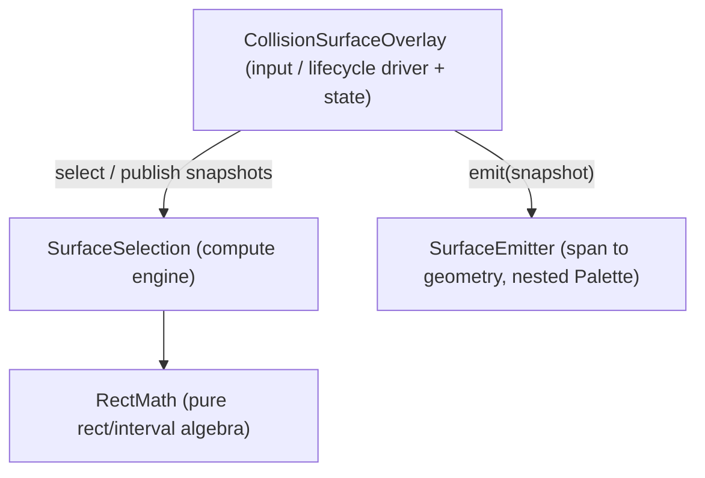

# Surface / overlay pipeline refactor

Behavior-preserving structural refactor of the client surface/overlay pipeline. Every step is a move/delete + repoint (no algorithm change), one commit, validated per [`AGENTS.md`](AGENTS.md) stage-gating. Source map: [`docs/surface-code-index.md`](docs/surface-code-index.md).

## Scope

Two files change structurally, two new files are created, one dead subsystem is deleted. Unchanged: the `Overlay`/`WorldOverlay` frameworks and managers, the settings stack, `MobWalkClient`, and the shared records (`EntityProfile`, `StandableRect`, `OccluderSpan`, `DownSkirtSpan`, `HoleSpan`). The `drawOnVisibleFace` bugfix only added a `computeDownSkirts(..., visual)` overload that stays on `SurfaceSelection` (compute-side classifier, not in the `RectMath` list), so it does not move any extraction boundary; the merge tuple stays `(topY, visualTopY)`.

## Target module map

**Compute side:**
- **`SurfaceSelection` (kept)** — the size-aware compute engine: the expose kernel (`exposeBox`/`wallOccluder`/`occluderColumns`/`visibleTop` + `WorldBox`/`CellSurface`), the `LazyFlood` reachability engine, the edge-span classifiers (occluder/down-skirt/hole), plus the orchestrator state (`select`/`clear`/`allX`/`requestDebugDump` + held lists) and `/mobwalk dump` logging. These are one algorithm (dilate → flood → merge → classify) that co-evolves and shares intimate internals (the per-box memo, the lock-step `occluderColumns` shell, `exposeBox` reused by hole ledge-gather) — it stays one file.
- **`RectMath` (new)** — the pure, stateless rect/interval algebra the engine builds on: `subtractRects`/`subtractOne`, `union`, `stripMerge`/`mergeAlong`, `mergeCoplanar`, `mergeCoplanarSplitFrontier`, `footprintAdjacent`, `depthForMerged`, `withDepth`, `coversAnySeed`, `subtractIntervals`, `spanKey`/`minDepth`, the static `flood`, and the `Rect` record. No world access, no state.

**Render side (from `CollisionSurfaceOverlay`):**
- **`CollisionSurfaceOverlay` (kept)** — the input/lifecycle driver, and the whole residual client-thread state machine: fields, `id`/`extract`/`isVisible`/`publish`, and all input methods (`onUseItem`, `resolveDownward`, `applyFloodRadius`, `reselectWithMobProfile`, `clearSelectionForSoftDisable`, `wantsRadiusScroll`, `adjustRadius`, `dumpFloodDebug`). Input handling is **not** split out further: the input methods mutate the same state that `extract`/`publish`/`isVisible` read and coordinate the `SurfaceSelection` lifecycle — one cohesive machine. Rendering was the separable concern and it leaves via `SurfaceEmitter`. Drives `SurfaceSelection` on the client thread, publishes the `volatile` snapshots, delegates drawing.
- **`SurfaceEmitter` (new)** — turns a published snapshot into buffer geometry: `emit` + `emitDownSkirts`/`emitOccluders`/`emitHoles` + the `quad`/`fadedSkirt`/`vQuad` helpers, plus color derivation as a nested `static` `Palette` helper (`colorForDepth(depth, depthLimit)` folding the `walkableColor`-vs-`shadeByDepth` choice, cutoff-ring greying, and depth-hue; `depthColor`/`hsvToRgb`/`inCutoffRing`/`greyBlend` internal to it). `emitDownSkirts`/`emitOccluders` take no `skirtDepth` arg and occluder emission is style-independent. Reads only the immutable snapshots + render-time flags; makes the client-thread/render-thread boundary physical.

**Deleted:** the eager-flood oracle — `selectEager`, the `LAZY`/`PROFILE_FLOOD` flags, and the eager-only parity/coverage-compare harness (`coverageMatches`/`groupByTop`/`levelCoversSame`/`zSpan`/`intervalsEqual`).

## Steps (ordered)

1. **Delete the eager-flood oracle.** Remove `selectEager`, the `LAZY`/`PROFILE_FLOOD` flags, and the eager-only compare helpers (`coverageMatches`/`groupByTop`/`levelCoversSame`/`zSpan`/`intervalsEqual`). First, because it is the biggest single simplification, removes the two-implementation sync burden, and shrinks the file before any extraction moves code. Keep `/mobwalk dump` (`logFloodDebug*`), and keep the static `flood` + `SurfaceGeometryTest`'s flood cases as the standing guard on the adjacency/reach rule (deleting the oracle removes the automated `LazyFlood` cross-check, so this coverage matters more).
2. **Extract `RectMath`.** Move the pure algebra listed above (with `Rect`) into `RectMath`; repoint `SurfaceSelection` call sites and `SurfaceGeometryTest`. Lowest-risk extraction, everything above it depends on it, and the unit tests pin it — do it before touching the render side so the engine is already thinned.
3. **Extract `SurfaceEmitter`.** Move `emit`/`emit*`/quad helpers and the color logic (as the nested `Palette` helper) into `SurfaceEmitter`, consuming the published snapshot + render flags; `CollisionSurfaceOverlay.emit` becomes a one-line delegate. `emitDownSkirts`/`emitOccluders` no longer take a `skirtDepth` arg and occluder emission is style-independent, so the move is slightly simpler than earlier drafts implied; method names to move are otherwise unchanged. Leaves the overlay as the input driver and closes the client-thread/render-thread split.
4. **Split the flat client package into subpackages.** Purely structural, after the extractions so it moves each file once. Group `client`'s 25 flat files into the layout below (`git mv` + rewrite each `package` line + repoint imports); retire the `widgets` subpackage. Done last because the extractions are the behavioral/risky part and this is a mechanical move that gates cleanly on `./gradlew test`.

   **Target package layout** (in-world and HUD overlays share one `overlay` package — splitting a 3- and a 2-file package fragments too far):

   | Package | Files |
   |---|---|
   | `client` (bootstrap) | `MobWalkClient`, `InitHandler` |
   | `client.config` | `Configs`, `GuiConfigs`, `MobWalkModMenuIntegration`, `WandItem`, `ProfileRoster`, `RosterProfileOption`, `BuiltinProfilesTableEdit`, `CustomProfilesTableEdit`, `ProfilesTableEdit`, `ProfilesTableEditEntry`, `CustomProfileTableRows` |
   | `client.overlay` | `Overlay`, `OverlayManager`, `RadiusIndicatorOverlay`, `WorldOverlay`, `WorldOverlayManager` |
   | `client.surface` | `EntityProfile`, `StandableRect`, `OccluderSpan`, `DownSkirtSpan`, `HoleSpan`, `SurfaceSelection`, `RectMath`, `CollisionSurfaceOverlay`, `SurfaceEmitter` |

   **Java package semantics that shape this step:** a package is one directory with no subpackage-visibility — `client.surface` and `client` cannot see each other's package-private (default-access) members. Two consequences: (a) every test must sit in the *same* package as the type whose package-private surface it exercises, so the tests move with their owners; (b) any package-private member now read across a new package boundary must be widened to `public`. Prefer keeping collaborators in the same package over widening; audit the cross-package call sites (`MobWalkClient`/`Configs` → `WorldOverlayManager.collisionSurface()`, overlay ↔ surface, config ↔ surface) and widen only what the compiler forces. **Test moves** (mirror source packages): `SurfaceGeometryTest`, `HeadroomTest`, `VisualTopTest`, `OccluderClassificationTest`, `DownSkirtComputeTest`, `DropClassificationTest`, `HoleFootprintTest`, `HoleSubSpanTest`, `EntityProfileTest` → `client.surface`; `ProfileRosterTest`, `WandItemTest`, `CustomProfileTableRowsTest` → `client.config`.

Each step updates its own docs in the same commit ([`surface-code-index.md`](docs/surface-code-index.md) file map; drop oracle/`PROFILE_FLOOD` mentions in [`geometry.md`](docs/geometry.md)/[`rendering.md`](docs/rendering.md)). Step 2 is pure-logic and may gate on `./gradlew test`; steps 1 and 3 touch flood/emit behavior and need an in-game checklist (tops/skirts/occluders/holes/cutoff-ring/visual-top intact; `/mobwalk dump` still writes counts). Step 4 is a pure move gating on `./gradlew test`.

## API that must stay stable

**Public callers:**
- `SurfaceSelection.select(level,start,radius,profile,computeVisualTop)`, `clear()`, `allRects()`, `allOccluders()`, `allDownSkirts()`, `allHoles()`, `requestDebugDump()` — called by `CollisionSurfaceOverlay`.
- `CollisionSurfaceOverlay`: `WorldOverlay` hooks `id`/`extract`/`emit`/`isVisible`/`onUseItem`, plus `applyFloodRadius`, `reselectWithMobProfile`, `clearSelectionForSoftDisable`, `wantsRadiusScroll`, `adjustRadius`, `dumpFloodDebug()`→`FloodDebugCounts` (called by `MobWalkClient`/`Configs`); `WorldOverlayManager.collisionSurface()`.
- Record public shapes: `StandableRect`, `OccluderSpan`, `DownSkirtSpan`, `HoleSpan`, `EntityProfile`(+`Option`).

**Package-visible test surface** (keep reachable — same package + package-private, or move the test alongside its new owner and repoint):
- `SurfaceGeometryTest` → `subtractRects`, `union`, `mergeCoplanar`, `mergeCoplanarSplitFrontier`, `footprintAdjacent`, `flood`, `depthForMerged` (now on `RectMath`).
- `HeadroomTest`/`VisualTopTest` → `exposeBox`; `OccluderClassificationTest` → `occluderSpansForRect`/`mergeOccluderSpans`; `DownSkirtComputeTest` → `computeDownSkirts`; `DropClassificationTest` → `classifyDrop`; `HoleFootprintTest` → `fallFootprint`; `HoleSubSpanTest` → `holeSubSpans` (all stay on `SurfaceSelection`).
- `EntityProfileTest` → `EntityProfile` API.

## Risks / checkpoints

- **Oracle deletion is the only behavior-adjacent removal.** Confirm nothing outside the eager path calls `selectEager`/the compare helpers before deleting; verify normal selection and `/mobwalk dump` are unchanged in-game. If the static `flood` proves reachable only via tests after deletion, keep it (with its tests) as the adjacency/reach guard.
- **Thread contract.** `SurfaceEmitter` must read only the published `volatile` snapshots, never `SurfaceSelection`'s live lists; check no live-list read leaks onto the render thread after step 3.
- **Expose kernel stays put.** The per-box memo/`OUTLINE_TOP_REL` and the lock-step `occluderColumns` shell are why `exposeBox`/flood/classifiers stay in one file — keep them together; verify soul-sand/mud visual-top still lifts when `drawOnVisibleFace` is on, and toggling that setting re-floods.
- **Test visibility** is the likeliest compile breakage — gate every move on `./gradlew test` green.
- **Behavior preservation.** These are moves/deletes + repoints, not rewrites; no algorithm change intended.
